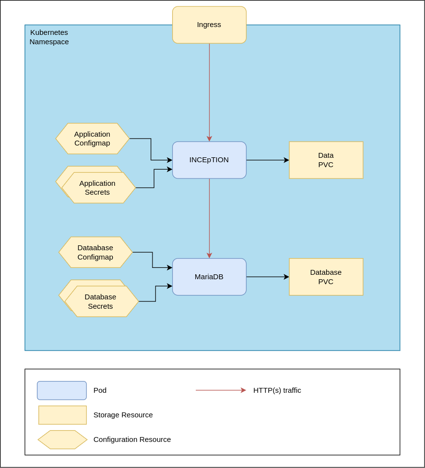

# INCEpTION

  

A semantic annotation platform offering intelligent assistance and knowledge management.

**Homepage:** <https://inception-project.github.io>

## Source Code

* <https://github.com/inception-project/inception>

## Requirements

Kubernetes: `>=v1.24.0-0`

| Repository | Name | Version |
|------------|------|---------|
| oci://registry-1.docker.io/bitnamicharts | mariadb(mariadb) | 19.0.1 |

## Deployment Architecture

This Chart allows INCEpTION to be deployed as follows :



## Installing the Chart

The default Chart values allows the deployment of a working (although unsecure) version of INCEpTION out-of-the-box.

To install the chart, just type :

```sh
helm upgrade --install inception ./chart/inception/
```

## Values

### Helm Release settings

| Key | Type | Default | Description |
|-----|------|---------|-------------|
| nameOverride | string | `""` | Custom Helm Release name. |
| fullnameOverride | string | `""` | Custom Helm Release full name. |

### INCEpTION configuration settings

| Key | Type | Default | Description |
|-----|------|---------|-------------|
| config.baseUrl | string | `"/"` | Base URL prefix on which INCEpTION is deployed. |
| config.logging | string | `"INFO"` | INCEpTION log level (affects the application and Spring Security framework). |
| config.security.acceptedOrigins | string | `"localhost"` | Accepted origin (see [dedicated INCEpTION documentation](https://inception-project.github.io/releases/33.2/docs/admin-guide.html#sect_reverse_proxy)). |
| config.security.allowHttp | bool | `false` | Allows HTTP unsecure communications. |
| config.database.name | string | `"inception"` | Database name. |
| config.database.hostname | string | `""` | Database hostname. |
| config.database.port | int | `3306` | Database port. |
| config.database.useSSL | bool | `false` | Database SSL communication. |
| config.database.serverTimezone | string | `"UTC"` | Database server timezone. |
| config.database.auth.username | string | `"inception"` | INCEpTION user name. |
| config.database.auth.password.value | string | `"t0t4llYSecreT"` | INCEpTION user password, in plain text (**NOT RECOMMENDED FOR PRODUCTION**).     Ignored if a reference to an external secret is specified. |
| config.database.auth.password.existingSecret.secretName | string | `""` | Name of the secret holding holding INCEpTION user's password. |
| config.database.auth.password.existingSecret.secretKey | string | `""` | Key inside the secret holding INCEpTION user's password. |
| config.extraConfig | object | `{}` | Extra configuration added at the end of the `settings.properties` file, in `key: value` format. |

### INCEpTION authentication settings

| Key | Type | Default | Description |
|-----|------|---------|-------------|
| auth.defaultAdmin.enabled | bool | `false` | Enables the "Default Administrator" feature. |
| auth.defaultAdmin.username | string | `"admin"` | Default Administrator username. |
| auth.defaultAdmin.password.value | string | `"loc@lAdmin!*"` | Password in plain text (**NOT RECOMMENDED FOR PRODUCTION**).     `bcrypt` hash will be derived from that password and stored in the `settings.properties` file. |
| auth.defaultAdmin.password.existingSecret.secretName | string | `""` | Name of the secret holding the password's bcrypt hash's value. |
| auth.defaultAdmin.password.existingSecret.secretKey | string | `""` | Key inside the secret holding the password's bcrypt hash value, in `{bcrypt}XXXXXX` format. |
| auth.oauth2.enabled | bool | `false` | Enabled OAuth2 SSO login. |
| auth.oauth2.autoLogin | bool | `false` | Enables OAuth2 as default login method (skips INCEpTION's default login page). |
| auth.oauth2.clientName | string | `""` | OAuth2 client name, to be displayed on INCEpTION's login page. |
| auth.oauth2.clientID | string | `""` | OAUth2 client ID. |
| auth.oauth2.clientSecret.value | string | `""` | OAuth2 client secret in plain text (**NOT RECOMMENDED FOR PRODUCTION**).    Ignored if a reference to an external secret is specified. |
| auth.oauth2.clientSecret.existingSecret.secretName | string | `""` | Name of the secret holding the OAuth2 client secret value. |
| auth.oauth2.clientSecret.existingSecret.secretKey | string | `""` | Key inside the secret holding the OAuth2 secret's value. |
| auth.oauth2.scope | string | `""` | OAuth2 scope. |
| auth.oauth2.authorizationGrantType | string | `""` | OAuth2 grant type. |
| auth.oauth2.redirectURI | string | `""` | OAuth2 redirect URI. |
| auth.oauth2.issuerURI | string | `""` | OAuth2 Issuer URI. |
| auth.oauth2.usernameAttribute | string | `""` | OAuth2 claim holding the username attribute. |
| auth.saml2.enabled | bool | `false` | Enables SAML2 SSO login. |
| auth.saml2.autoLogin | bool | `false` | Enables SAML2 as default login method (skips INCEpTION's default login page). |
| auth.saml2.signRequest.enabled | bool | `false` | Enables SAML2 request signing. |
| auth.saml2.signRequest.certificateValue | string | `""` | Public certificate value un plain text.    Ignored if a reference to an external TLS Secret is specified. |
| auth.saml2.signRequest.privateKeyValue | string | `""` | Private Key value, in plain text (**NOT RECOMMENDED FOR PRODUCTION**).    Ignored if a reference to an external secret is specified.  |
| auth.saml2.signRequest.existingTlsSecret | string | `""` | Reference to an external Kubernetes TLS secret in the same namespace holding the certificate/private key pair to sign SAML2 requests. |
| auth.saml2.assertingPartyCertificate.value | string | `""` | Certificate in plain text.     Ignored if a reference to an external Secret is specified. |
| auth.saml2.assertingPartyCertificate.existingSecret.secretName | string | `""` | Name of the secret holding the Identity Provider certificate. |
| auth.saml2.assertingPartyCertificate.existingSecret.secretKey | string | `""` | Key inside the secret holding the Identity Provider certificate. |
| auth.saml2.assertingPartyEntityID | string | `""` | Identity Provider's SAML2 Asserting ID. |
| auth.saml2.assertingPartySSOUrl | string | `""` | Identity Provider's SAML2 SSO URL. |
| auth.preAuthentication.enabled | bool | `false` | Enables the PreAuthentication feature. |
| auth.preAuthentication.headerPrincipal | string | `""` | Name of the header holding the remote user name. |
| auth.preAuthentication.newUserRole | string | `""` | Role given to new pre-authenticated users. |
| auth.preAuthentication.customUserRoles | object | `{}` | Roles to map to dedicated pre-authenticated users, in the `username: role` format. |

### INCEpTION deployment settings

| Key | Type | Default | Description |
|-----|------|---------|-------------|
| replicaCount | int | `1` | Number of replicas fir INCEpTION deployment. |
| podAnnotations | object | `{}` | Extra annotations for INCEpTION's pod. |
| podLabels | object | `{}` | Extra labels for INCEpTION's pod. |
| initContainers | object | `{}` | User-defined init-container to run before INCEpTION pod, as defined in [Kubernetes documentation](https://kubernetes.io/docs/concepts/workloads/pods/init-containers/). |
| extraContainers | object | `{}` | User-defined extra containers to run alongside INCEpTION pod, as defined in [Kubernetes documentation](https://kubernetes.io/docs/concepts/workloads/pods/#using-pods). |
| extraEnv | object | `{}` | Extra environment variables for INCEpTION's container. |
| extraVolumes | object | `{}` | Extra volume definition for INCEpTION's pod. |
| extraVolumeMounts | object | `{}` | Extra volume mounts for INCEpTION's pod. |
| image.repository | string | `"ghcr.io/inception-project/inception"` | Image repository. |
| image.pullPolicy | string | `"IfNotPresent"` | Image Pull Policy. |
| image.tag | string | `"33.3"` | Image tag. |
| imagePullSecrets | object | `{}` | INCEpTION container image Pull Secret. |
| startupProbe.enabled | bool | `true` | Enables the startup probe. |
| startupProbe.initialDelaySeconds | int | `30` | Startup probe initial startup delay. |
| startupProbe.periodSeconds | int | `10` | Startup probe check interval, in seconds. |
| startupProbe.failureThreshold | int | `5` | Startup probe's number of accepted failures. |
| livenessProbe.enabled | bool | `true` | Enables the liveness probe. |
| livenessProbe.initialDelaySeconds | int | `0` | Liveness probe initial startup delay. |
| livenessProbe.periodSeconds | int | `5` | Liveness probe check interval, in seconds. |
| livenessProbe.failureThreshold | int | `2` | Liveness probe's number of accepted failures. |
| podSecurityContext.runAsUser | int | `2000` | User ID to run as. |
| podSecurityContext.runAsGroup | int | `2000` | Group ID to run as. |
| podSecurityContext.fsGroup | int | `2000` | Group ID authorized to mount external PVCs. |
| podSecurityContext.runAsNonRoot | bool | `true` | Allowing container(s) to run as root. |
| securityContext.readOnlyRootFilesystem | bool | `true` | Enforcing read-only root filesystem (`/`). |
| securityContext.privileged | bool | `false` | Enables running the pod as privileged. |
| resources | object | `{}` | INCEpTION pod's resources. |
| autoscaling.enabled | bool | `false` | Enables horizontal pod autoscaling. |
| autoscaling.minReplicas | int | `1` | Minimum number of pod replicas. |
| autoscaling.maxReplicas | int | `3` | Maximum number of pod replicas. |
| autoscaling.targetCPUUtilizationPercentage | int | `80` | Target CPU usage percentage to trigger the deployment of a new replica. |
| autoscaling.targetMemoryUtilizationPercentage | int | `80` | Target memory usage percentage to trigger the deployment of a new replica. |
| serviceAccount.create | bool | `true` | Specifies whether a service account should be created. |
| serviceAccount.automount | bool | `true` | Automatically mount a ServiceAccount's API credentials. |
| serviceAccount.annotations | object | `{}` | Annotations to add to the service account. |
| serviceAccount.name | string | `""` | The name of the service account to use.    If not set and create is true, a name is generated using the fullname template. |
| nodeSelector | object | `{}` | INCEpTION pod node selector. |
| tolerations | list | `[]` | INCEpTION pod tolerations. |
| affinity | object | `{}` | INCEpTION pod affinities. |
| persistence.data.storageClassName | string | `"standard"` | Name of the Storage Class to use. |
| persistence.data.size | string | `"5Gi"` | Requested volume size. |
| persistence.data.accessMode | string | `"ReadWriteOnce"` | Persistent Volume Claim Access Mode |

### INCEpTION network settings

| Key | Type | Default | Description |
|-----|------|---------|-------------|
| networkPolicies.enabled | bool | `true` | Enables the default Network Policies. |
| service.type | string | `"ClusterIP"` | Service type. |
| service.port | int | `8080` | Service port. |
| ingress.enabled | bool | `true` | Enables Ingress. |
| ingress.className | string | `"nginx"` | Ingress class name. |
| ingress.hosts | list | Defined on `localhost:80`, listening on `/` | Ingress host settings. |
| ingress.tls | list | `[]` | Ingress TLS settings. |

### INCEpTION's database deployment settings

| Key | Type | Default | Description |
|-----|------|---------|-------------|
| mariadb.enabled | bool | `true` | Enables embedded MariaDB. |
| mariadb.image.debug | bool | `false` | Enables debug logging. |
| mariadb.primary.service.ports.mysql | int | `3306` | Mariadb `mysql`port. |
| mariadb.primary.configuration | string | Enforce UTF8 character set. | MariaDB Primary configuration to be injected as ConfigMap. |
| mariadb.auth.database | string | `"inception"` | Name for a custom database to create. |
| mariadb.auth.username | string | `"inception"` | Name for a custom user to create. |
| mariadb.auth.password | string | `"t0t4llYSecreT"` | Password for the new user, in plain text (**NOT RECOMMENDED FOR PRODUCTION**). Ignored if existing secret is provided. |
| mariadb.auth.existingSecret | string | `""` | Use existing secret for password details (auth.rootPassword, auth.password, auth.replicationPassword will be ignored and picked up from this secret).     The secret has to contain the keys `mariadb-root-password`, `mariadb-replication-password` and `mariadb-password`. |
| mariadb.networkPolicy.enabled | bool | `true` | Enable creation of NetworkPolicy resources. |
| mariadb.networkPolicy.allowExternal | bool | `false` | The Policy model to apply. |

----------------------------------------------
Autogenerated from chart metadata using [helm-docs v1.14.2](https://github.com/norwoodj/helm-docs/releases/v1.14.2)