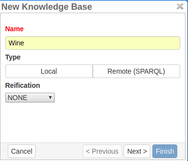
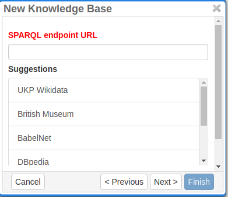
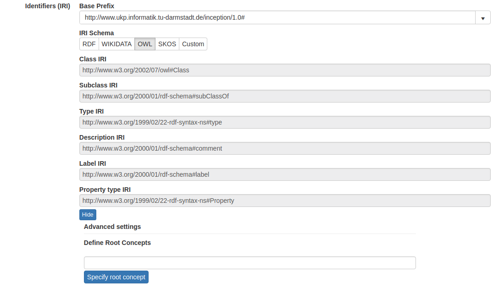
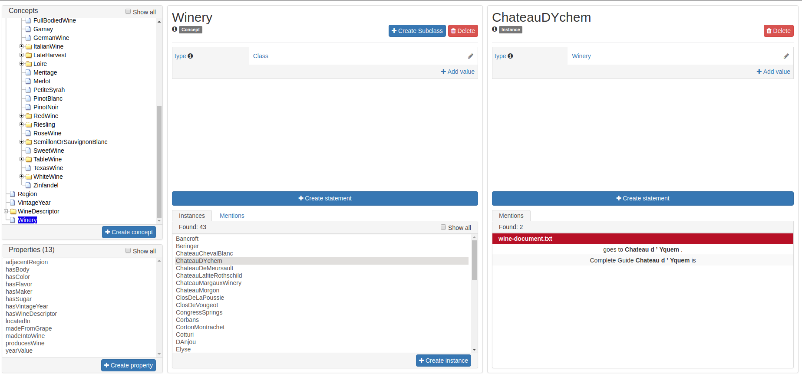
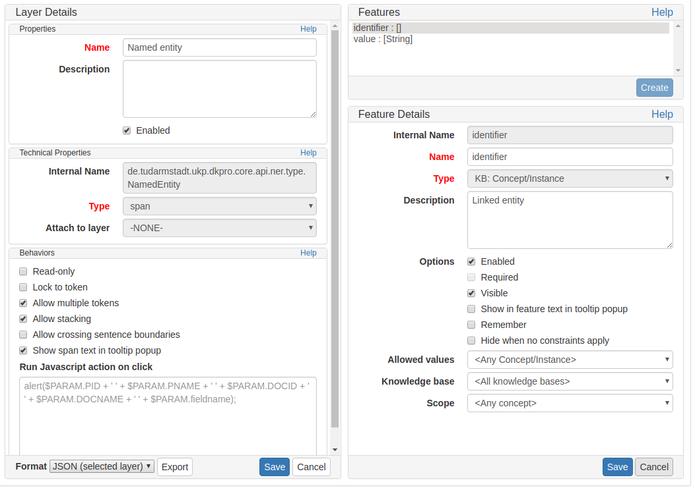

[[sect_knowledge_base]]
=== Knowledge Base 

The Knowledge base (KB) module of INCEpTION enables the user to create a KB from scratch or to import it from an RDF file. Alternatively, the user can connect to a remote KB using SPARQL. However, editing the content of remote KBs is currently not supported. The Knowledge base enables the user to annotate the text with entities from KB. 

This section briefly describes how to set up a KB in the KB management page on *Projects Settings* and explain the features provided on the *Knowledge Base* page along with the support for feature layers providing the annotations for KB entities. 

==== Setting up a knowledge base 

In the *Projects Settings*, switch to the *Knowledge Bases* tab, then click *New…* on the bottom
 and a dialogue box shows as in the figure below.

[.thumb]

To create a *LOCAL | REMOTE*  knowledge base, one needs to choose *Local* for the type. For the reification,
*NONE* is the defaut case, but to support qualifiers, one needs to choose *WIKIDATA* for the Reification. 

For the local KB, the user has to choose a file, in case one needs to import a local KB. Alternatively, the user can skip the step to create an empty KB to create a knowledge base from scratch. 

For the remote KB, INCEpTION provides the user with some pre-configured knowledge base such as WikiData, British Museum, BabelNet, DBPediaa and Yago. The user has an option to set up a remote KB apart from the pre-configured ones, in which case the user needs to provide the SPARQL endpoint URL for the Knowledge base as in the figure below.

[.thumb]

In the next step, the user is offered a configurable mapping which relies on a minimal set of IRIs that must be defined for any KB used with the platform. The user can choose one of the pre-configured mapping or provide their own custom defined mapping as shown in the figure below. In the advanced settings, the user can leverage this feature of KB settings when one doesn't want the entire knowledge base to be used and rather choose to identify some specific root concepts. This feature specially helps in case of large knowledge bases such as Wikidata.
 
[.thumb]

==== Knowledge Base Page

The knowledge base page provides you with a concept tree hierarchy with a list of instances and statements associated along with the list of properties as shown in the figure below. The user can edit the *LOCAL* knowledge base here which includes adding, editing and deletion of concepts, properties, statements and instances. 

The knowledge base page provides the specific mentions of concepts and instances annotated in the text in the *Mentions* block. 

[.thumb]

==== Knowledge Base Scope setting for feature layer

In the *Projects Settings*, switch to the *Layers* tab where the user can edit the configuration for the pre-defined layers or create a new layer with a click *Create* on the bottom of the panel. The user can define several features for each of the layer as shown in the below figure.

[.thumb]

The feature configuration needs a name along with the *Type* which sets the primary scope of the feature. The dropdown provides the user with an option of *KB: Concept/Instance* which sets the scope of the feature to knowledge base entities. 

Furthermore, the feature configuration, if set to *KB: Concept/Instance* asks for the *Allowed values* which has three values as options: *Any Concept/Instance*, *Only Concept* and *Only Instance*. When the user annotates the text with the particular layer for this feature which has been configures for *Any Concept/Instance* , the auto complete field lists all the concept and instances, while for *Only Concept* and *Only Instance* it list only concept or only instance respectively.

The feature configuration allows the user to set up the configuration to list the values from a specific Knowledge base. 

The *Scope* field sets the configuration of the feature with a specific concept allowing the values for the auto complete field from a specific range of values which includes everything with "is-a" relationship with the specific concept mentioned here. In case the user selects *Any Concept/Instance*, the values will be instances of the specified concept and the child concepts (which includes the hierarchy of child concepts) including their instances, of the specified concept in the *Scope*. Likewise, the choice of *Only Concept* limit the values to the child concepts (which includes the hierarchy of child concepts) and  *Only Instance* limit the values to all of the instances and the instances for the child concepts of the specified concept. 

