// Licensed to the Technische Universität Darmstadt under one
// or more contributor license agreements.  See the NOTICE file
// distributed with this work for additional information
// regarding copyright ownership.  The Technische Universität Darmstadt
// licenses this file to you under the Apache License, Version 2.0 (the
// "License"); you may not use this file except in compliance
// with the License.
//
// http://www.apache.org/licenses/LICENSE-2.0
//
// Unless required by applicable law or agreed to in writing, software
// distributed under the License is distributed on an "AS IS" BASIS,
// WITHOUT WARRANTIES OR CONDITIONS OF ANY KIND, either express or implied.
// See the License for the specific language governing permissions and
// limitations under the License.

This _Getting Started_ Guide helps new users to install, start and work with {product-name}.
It gives a quick overview (estimated time for reading only: approx. 20-30 minutes) on the key functionalities in order to get familiar with the tool.
It excludes special cases and details due to simplicity and focuses on the first steps. <<See our documentation for further reading>> on any topic.
You are already in the User Guide document.
The main documentation of this User Guide starts right after the _Getting Started_ section: <<sect_core_funct, Core Functionalities>>.

For quick overviews, also see our https://www.youtube.com/playlist?list=PL5Hz5pttaj96SlXHGRZf8KzlYvpVHIoL-[tutorial videos^] e.g. covering an https://www.youtube.com/watch?v=Ely8eBKqiSI&list=PL5Hz5pttaj96SlXHGRZf8KzlYvpVHIoL-&index=1[Introduction^], an https://www.youtube.com/watch?v=wp4AN3p23mQ&list=PL5Hz5pttaj96SlXHGRZf8KzlYvpVHIoL-&index=2[Overview^], https://www.youtube.com/watch?v=Xz3Hs8Lyoeg&list=PL5Hz5pttaj96SlXHGRZf8KzlYvpVHIoL-&index=3[Recommender Basics^] and https://www.youtube.com/watch?v=p5SQq5W1rQI&list=PL5Hz5pttaj96SlXHGRZf8KzlYvpVHIoL-&index=4[Entity Linking^].
_Getting Started_ will refer to them wherever it might be helpful.

NOTE: *Boxes:* In _Getting Started_, these boxes provide additional information.
      They may be skipped for fast reading if background knowledge exists.
      Also, they may be consulted later on for a quick look-up on basic concepts.

After the <<Introduction>>, _Getting Started_ leads you to using {product-name} in three steps:

. We will see how to install it in <<Installing and starting {product-name}>>.
. In <<sect_intro_settings>> and <<sect_intro_structure>>, for a basic orientation and understanding the structure of a project will be explained.
. You will be guided to make your first annotations in <<First Annotations with {product-name}>>.

= Introduction

== What can {product-name} be used for?

For a first impression on what {product-name} is, you may want to watch our https://www.youtube.com/watch?v=Ely8eBKqiSI&list=PL5Hz5pttaj96SlXHGRZf8KzlYvpVHIoL-&index=1[introduction video^].

{product-name} is a *text-annotation environment* useful for various kinds of annotation tasks on written text.
Annotations are usually used for linguistic and/or machine learning concerns. {product-name} is a web application in which several users can work on the same annotation project and it can contain several annotation projects at a time.
It provides a recommender system to help you create annotations faster and easier.
Beyond annotating, you can also create a corpus by searching an external document repository and xref:documents_in_getting_started[adding documents].
Moreover, you can use knowledge bases, e.g. for tasks like xref:named_entity_recognition_in_getting_started[entity linking].

The following picture gives you a first impression on how annotated texts look like.
In this example, text xref:layers_and_features_in_getting_started[spans] have been annotated as whether they refer to a person (PER), location (LOC), organization (ORG) or any other (OTH).

[.right]
image::images/getting_started_example_for_annotations.png[width=400]

{product-name}'s key features are: First, before you annotate, you need a corpus to be annotated (*Corpus Creation*).
You might have one already and import it or create it in {product-name}.
Second, you might want to annotate the corpus (*Annotation*) and/or merge the annotations which different annotators made (*Curation*).
Third, you might want to integrate external knowledge used for annotating (*Knowledge Bases*).
You can do all three steps with {product-name} or only one or two. +
In addition, {product-name} is extendable and adaptable to individual requirements.
Often, it provides predefined elements, like xref:knowledge_bases_in_getting_started[knowledge bases], xref:layers_and_features_in_getting_started[layers] and xref:tagsets_in_getting_started[tagsets] to give you a starting point but you can also modify them or create your own from scratch.
You may for example integrate a knowledge base of your choice; create and modify custom knowledge bases; create and modify custom layers and tagsets to annotate your individual task; build custom so-called xref:recommenders_in_getting_started[recommenders] which automatically suggest annotations to you so you will work quicker and easier; and much more.

_Getting Started_ focuses on annotating.
For details on any other topic like Corpus Creation or the like, see the main documentation part of this User Guide: <<sect_core_funct, Core Functionalities>>.

[[do_you_have_questions_or_feedback]]
== Do you have questions or feedback?

{product-name} is still in development, so you are welcome to give us feedback and tell us your wishes and requirements.

* For many questions, you find answers in the *main documentation*: <<sect_core_funct, Core Functionalities>>.

* Consider our *Google group* https://groups.google.com/forum/#!forum/inception-users[inception users^] and *mailing list*: inception-users@googlegroups.com

* You can also open an issue on https://github.com/inception-project/inception/issues[*Github*^].

== See our documentation for further reading

Our main documentation consists of three distinct documents:

* *User Guide*: If you only _use_ {product-name} and do not develop it, the <<sect_core_funct, User Guide>> beginning right after _Getting Started_ is the one of your choice.
If it does not answer your questions, don't hesitate to contact us (see <<Do you have questions or feedback?>>).

NOTE: *User Guide-Shortcuts:* Whenever you find a *blue question mark* sign in the {product-name} application, you may click on it to be linked to the respective section of the User Guide.

* *Admin Guide*: For information on how to set up {product-name} for a group of users on a server and more installation details, see the https://inception-project.github.io/documentation/latest/admin-guide[Admin Guide^].

* *Developer Guide*: {product-name} is open source.
So if you would like to develop for it, the https://inception-project.github.io/documentation/latest/developer-guide[Developer Guide^] might be interesting for you.

All materials, including this guide, are available via the link:{product-website-url}[{product-name} homepage^].

= Installing and starting {product-name}

NOTE: **Hey system operators and admins!** If you install {product-name} not for yourself, but rather install it 
      for somebody else or for a group of users on a server, if want to perform a Docker-based deployment or need information on 
      similarly advanced topics (logging, monitoring, backup, etc.) , please skip this section and go directly to the
      https://inception-project.github.io/documentation/latest/admin-guide[Admin Guide^].

== Installing Java

In order to run {product-name}, you need to have Java installed in version 11 or higher.
If you do not have Java installed yet, please install the latest Java version e.g. from link:https://adoptopenjdk.net[AdoptOpenJDK^].

== Download and start {product-name}

In this section, we will download, open and log in to {product-name}.
After, we will download and import an Example Project:

*Step 1 - Download:* Download the .jar-file from our https://inception-project.github.io/downloads/[website^] by clicking on _INCEpTION x.xx.x (executable JAR)_ (instead of "`x.xx.x`", there will be the number of the last release).
Wait a minute until it has been fully downloaded.
That is, until the name of the downloaded folder ends on “.jar“, not on “.jar.part“ anymore.

NOTE: *Working with the latest version:* We recommend to always work with the latest version since we constantly add new features, improve usability and fix bugs.
After downloading the latest version, your previous work will not be lost: within a new version you will generally find all your projects, documents, users etc. like before without doing anything.
However, please consult the release notes on this beforehand.
To be notified when a new version has been released, please check the website, subscribe to Github notifications or the Google group (see <<Do you have questions or feedback?>>).

*Step 2 - Open:* There are two ways to open the application: Either by double-clicking on it or via the terminal.

*Step 2a - Open via double-click:* Now, simply double-click on the downloaded .jar-file.
After a moment, a splash screen will display.
It shows that the application is loading.

[.right]
image::images/getting_started_starting_the_jar_I.png[align="center",width=400]

NOTE: *In case {product-name} does not start:* If double-clicking the JAR file does not start {product-name}, you might need to make the file executable first.
Right-click on the JAR file and navigate through the settings and permissions.
There, you can mark it as executable.

Once the initialization is complete, a dialog appears.
Here, you can open the application in your default browser or shut it down again:

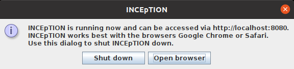

*Step 2b - Open via terminal:* If you prefer the command line, you may enter this command instead of double-clicking.
Make sure that instead of "`x.xx.x`", you enter the version you downloaded:

[source,text]
----
$ java -jar inception-app-standalone-x.xx.x.jar
----

In this case, no splash screen will appear.
Just go to http://localhost:8080/[_http://localhost:8080_] in your browser.

*Step 3 - Log in:* The first time you start the application, you will be asked to set a password for the default **admin** user. 
You need to enter this password into two separate fields. 
Only if the same password has been entered into both fields, it will be accepted and saved. 
After the password has been set, you will be redirected to the regular login screen where you can log in using the username **admin** and the password you have just set.

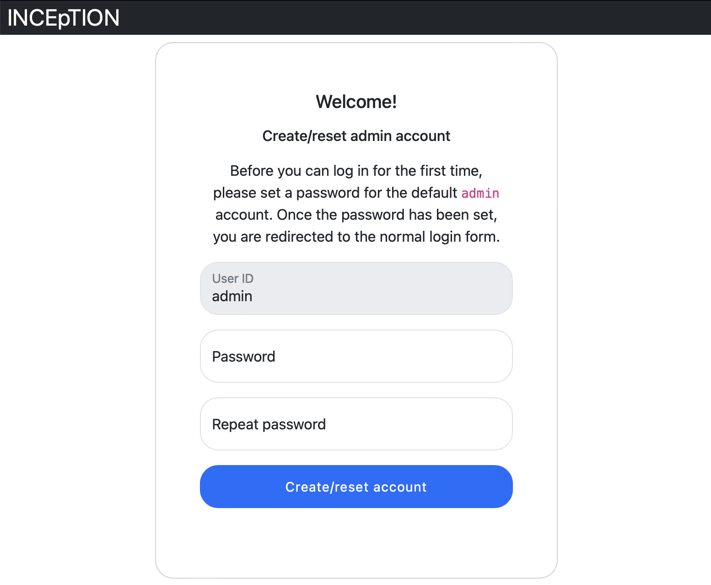

*You have finished the installation.*

NOTE: {product-name} is designed for the browsers *Chrome, Safari and Firefox*.
It does work in other browsers as well but for these three, we can support you best.
For more installation details, see the https://inception-project.github.io/documentation/latest/admin-guide[Admin Guide^].

== Download and import an Example Project

In order to understand what you read in this guide, it makes sense to have an annotation project to look at and click through.
We created several example projects for you to play with.
You find them in the section https://inception-project.github.io/example-projects/[Example Projects^] on our website.

[.right]
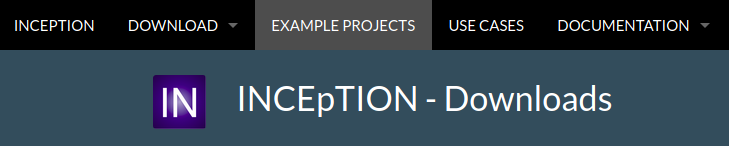

*Step 1 - Download:* For this guide, we use the _Interactive Concept Linking_ project.
Please download it from the https://inception-project.github.io/example-projects/[Example Projects^] section on our website and save it without extracting it first.
It consists of two documents about pets.
The first one contains some annotations as an example, the second one is meant to be your playground.
It has originally been created for concept linking annotation but in every project, you can create any kind of annotations.
We will use it for Named Entity Recognition.

[[named_entity_recognition_in_getting_started]]
NOTE: *Named Entity Recognition:* This is a certain kind of annotation.
In _Getting Started_, we use it to tell whether the annotated text part refers to a person (in {product-name}, the built-in tag for person is PER), organization (ORG), location (LOC) or any other (OTH). +
The respective layer to annotate person/organization/location/other is the _Named Entity_ layer.
If you are not sure what layers are, check the box on xref:layers_and_features_in_getting_started[Layers and Features] in the section <<Project Settings>>.
Also see <<Concept Linking>> in the User Guide.

* *Step 2 - Import:* After logging in to
{product-name}, click on the _Import project_ button on the top left (next to _Create new project_) and browse for the example project you have downloaded in Step 1. Finally, click _Import_.
The project has now been added and you can use it to follow the explanations of the next section.

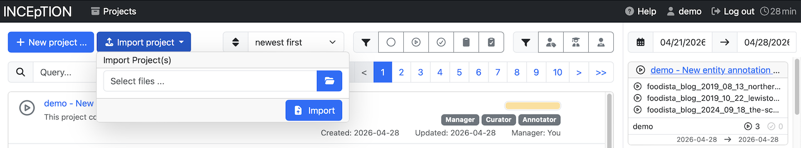

[[sect_intro_settings]]
== Project Settings

In this section we will see what elements each project _has_ and where you can adjust these elements by examining the <<Project Settings>>. Note that you may have different projects in {product-name} at the same time.

If you prefer to make some annotations first, you may go on with <<First Annotations with {product-name}>> and return later.

Each project consists at least of the following elements.
There are more optional elements such as tagsets, document repositories etc. but to get started, we will focus on the most important ones:

* one or (usually) more *Documents* to annotate
* one or (usually) more *Users* to work on the project
* one or (usually) more *Layers* to annotate with
* Optional: one or more *Knowledge Base/s*
* Optional: *Recommenders* to automatically suggest annotations
* Optional: *Guidelines* for you and your team

For a quick overview on the settings, you might want to watch our tutorial video https://www.youtube.com/watch?v=wp4AN3p23mQ&list=PL5Hz5pttaj96SlXHGRZf8KzlYvpVHIoL-&index=3&t=0s[Overview^].
As for all topics of _Getting Started_, you will find more details on each of them in the main documentation on <<sect_core_funct, {product-name}'s Core Functionalities>>.

The _Settings_ provide a tab for each of these elements.
There are more tabs but we focus on the most important ones to get started.
You reach the settings after logging in when you click on the name of a project and then on _Settings_ on the left.
If you have not imported the example project yet, we propose to follow the instruction in <<Download and import an Example Project>> first.

image::images/getting_started_settings.png[align="center"]

[[documents_in_getting_started]]
=== Documents
Here, you may upload your files to be annotated.
Make sure that the format selected in the dropdown on the right is the same as the one of the file to be uploaded.

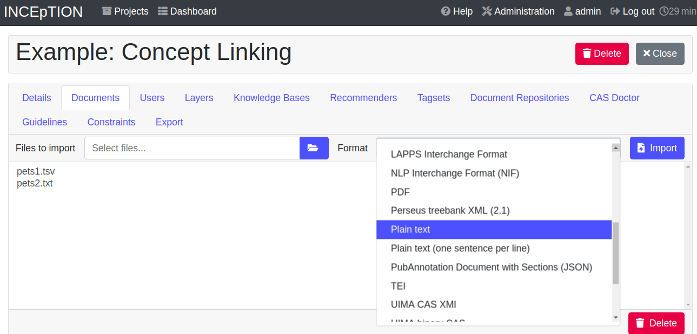

NOTE: *Formats:* For details on the different formats {product-name} provides for importing and exporting single documents as well as whole projects, you may check the main documentation, xref:sect_formats[Appendix A: Formats].

NOTE: *{product-name} Instance vs.
Project:* In some cases, we have to distinguish between the {product-name} *instance* we are working in and the *project(s)* it contains. +
For example, a user may be added to the {product-name} instance but not to a certain project.
Or she may have different roles in several projects.

[[users_in_getting_started]]
=== Users
Here, you may add users to your _project_ and change their roles within that project.
You can only add users to a project from the dropdown at the left if they exist already in the {product-name} _instance_.

* *Add new users:* In order to find users for a _project_ in the dropdown, you need to add them to your {product-name} _instance_ first.
Click on the *administration* button in the very top right corner and select section *Users* on the left.
For *Instance roles* (for an _instance_ of {product-name}) see the <<User Management>> in the main documentation.
+
image::images/getting_started_create_users.png[align="center"]
+
* *Assinging roles to users:* After selecting a user from the dropdown in the project settings section *Users*, you can check and uncheck the user's roles on the right side.
Project roles count for that _project_ only and are different from instance-wide roles which count for the whole {product-name} _instance_.
Any combination of roles is possible and the user will always have the sum of all roles given.
+
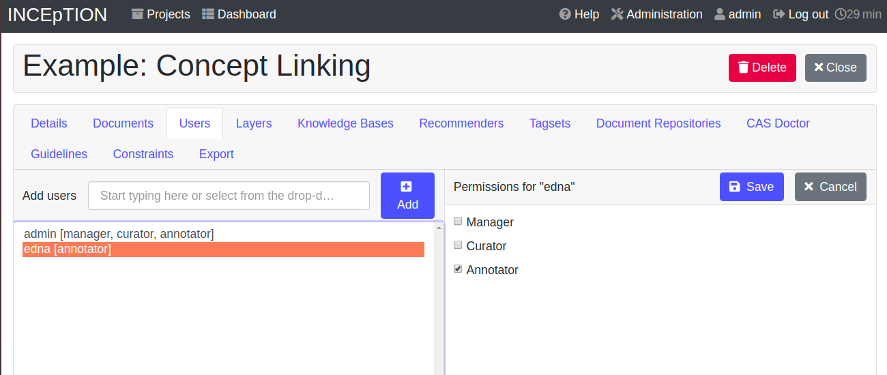
+
[[Project_roles]]

[cols=",,",]
|===
|Project role | Description | Access to Dashboard Sections

|Annotator |- annotate only |
- Annotation +
- Knowledge Base +

|Curator |- curate only|
- Curation +
- Workload +
- Agreement +
- Evaluation

|Manager |- annotate +
- curate +
- create projects +
- add new documents +
- add guidelines +
- manage users +
- open annotated documents of other users (read only) |- All pages
|===

[[layers_and_features_in_getting_started]]

=== Layers
In this section, you may create custom layers and modify them later.
Built-in layers should not be changed.
In case you do not want to work on built-in layers only but wish to create custom layers designed for your individual task, we recommend reading the documentation for details on <<Layers>>.

image::images/getting_started_layers.png[align="center"]

[[box_layers_and_features_in_getting_started]]
NOTE: *Layers and Features:* There are different "`aspects`" or "`categories`" you might want to annotate.
For example, you might want to annotate all the places and persons in a text and link them to a knowledge base entry (see the box about xref:knowledge_bases_in_getting_started[Knowledge Bases]) to tell _which_ concrete place or person they are.
This type of annotation is called _Named Entity_.
In another case, you might want to annotate which words are verbs, nouns, adjectives, prepositions and so on (called _Parts of Speech_).
What we called "`aspects`", "`categories`" or "`ways to annotate`" here, is referred to as *layers* in {product-name} as in many other annotation tools, too. +
{zwsp} +
{product-name} supports *span layers* in order to annotate a span from one character (“letter”) in the text to another, *relation layers* in order to annotate the relation between two span annotations and *chain layers* which are normally used to annotate coreferences, that is, to show that different words or phrases refer to the same person or object (but not which one).
A span layer annotation always anchors on one span only.
A relation layer annotation always anchors on the two span annotations of the relation.
Chains anchor on all spans which are part of the chain.
For span layers, the default granularity is to annotate one or more tokens (“words”) but you can adjust to character level or sentence level in the layer details (see <<sect_projects_layers>> in the main documentation; especially <<Properties>>). +
{zwsp} +
Each layer provides appropriate fields, so-called *features*, to enter a label for the annotation of the selected text part.
For example, on the _Named Entity_ layer in {product-name}, you find two feature-fields: _value_ and _identifier_.
In _value_, you can enter what kind of entity it is (“LOC” for a location, "`PER`" for a person, "`ORG`" for an organization and "`OTH`" for other).
In _identifier_ you can enter which concrete entity (which must be in the knowledge base) it is.
For the example "`Paris`", this may be the French capital; the person Paris Hilton; a company named "`Paris`" or something else.
{zwsp} +
{product-name} provides built-in layers with built-in features to give you a starting point.
Built-in layers cannot be deleted as custom layers can.
However, new features can be added.
See the main documentation for details on <<Layers>>, features, the different types of layers and features, how to create custom layers and how to adjust them for your individual task.

[[tagsets_in_getting_started]]
=== Tagsets
Behind this tab, you can modify and create the tagsets for your layers.
Tagsets are always bound to a layer, or more precisely to a certain feature of a layer.

NOTE: *Tagsets:* In order for all annotations to have consistent labels, it is preferable to use defined tags which can be given to the annotations.
If users do not enter free text for a label but stick to predefined tags, they avoid different names for the same thing and varying spelling.
A set of such defined tags is called a tagset i.e. a collection of labels which can be used for annotation.
{product-name} comes with predefined tagsets out of the box and they serve as a suggestion and starting point only.
You can modify them or create your own ones.

NOTE: *Feature Types:* The tags of your tagset must always fit the type of the feature for which it will be used.
The feature type defines what type of information the feature can be, for example "`Primitive: Integer`" for whole numbers, "`Primitive: Float`" for decimals; "`Primitive: Boolean`" for a true/false label only; the most common one "`Primitive: String`" for text labels or "`KB: Concept/Instance/Property`" if the feature shall link to a knowledge base.
There are more types for features but these are the most important ones for you to know. +
Changing the type does only work for custom features, not for built-in features.
In order to do so, scroll in the _Feature Details_ panel (in the _Layers_ tab) until you see the field _Type_ and select the type of your choice.
If a tagset shall be linked to a feature, they must have the same type.
For more details, see the <<Features>> in the main documentation.

* In order to *create a new tagset*, click on the blue create button on top.
Enter a name for it and - not technically necessary but highly recommended to avoid misunderstandings - a speaking description for the tagset.
As an example, let's choose "`Example_Tagset`" for the name and "`This tagset serves as a playground to get started.`" for the description.
Check or uncheck _Annotators may add new tags_ as you prefer.
Now, click on the blue save-button.
* In order to *fill your tagset with tags*, first choose the set from the list on the left.
Then, click on the blue create-button in the _Tags_ panel at the bottom.
A new panel called _Tag Details_ opens right beside it.
Enter a name and description for a tag.
Let's have "`CAT`" for the name and "`This tag is to be used for every mention of a cat and only for mentions of cats.`" for the description.
Click the save-button and the tag has now been added to your set.
As another example, create a new tag for the name "`DOG`" and description "`This tag is to be used for every mention of a dog and only for mentions of dogs.`".
+
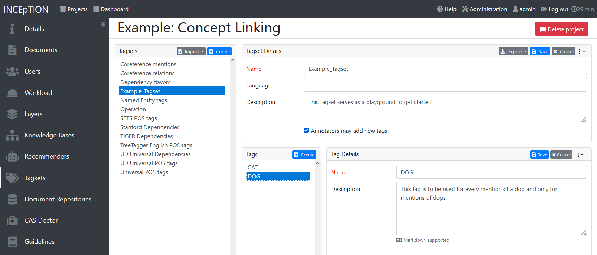
+
[[link_to_a_layer_and_feature]]
* In order to use the tagset, it is necessary to *link it to a layer and feature*.
Herefore, click on the _Layers_ tab and select the layer from the list at the left.
As an example, let's select the layer _Named entity_.
Two new panels open now: _Layer Details_ and _Features_.
We focus on the second one.
Choose the feature your tagset is made for.
In this example, we choose the feature _value_.
When you click on it, the panel _Feature details_ opens.
In this panel, scroll down to _Tagset_ and choose your tagset (to stick with our example: _Example_Tagset_) from the dropdown and click _Save_.
The tagset which was selected before is not linked to the layer any more but the new one is.
+
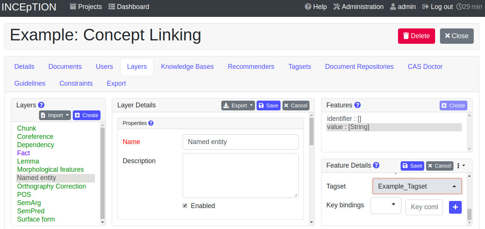
+
* From now on, you can select your tags for annotating.
Navigate to the annotation page (click _INCEpTION_ on the top left -> _Annotation_ and choose the document _pets2.txt_).
On the layer dropdown on the right, choose the layer _Named entity_.
When you double-click on any part in the text, for example "`Socke`" in line one, and click on the dropdown _value_ on the right, you find the tags "`DOG`" and "`CAT`" to choose from.
(For details on how to annotate, see <<First Annotations with {product-name}>>).
+
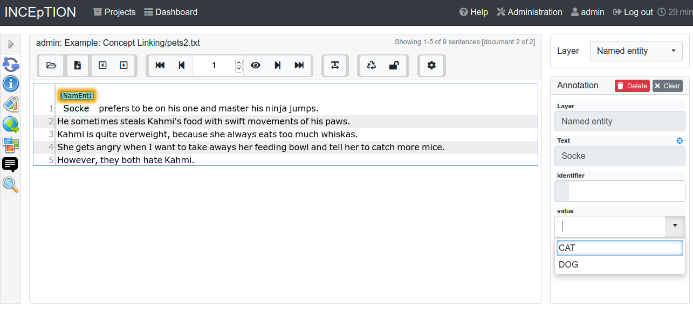
+
* You might want to link Named Entity tags again to the _Named entity_ Layer and _value_ feature in order to use them like they were before our little experiment.

* For more details on Tagsets, see the main documentation, <<Tagsets>>.

* _Note_: Tagsets can be changed and deleted.
But the annotations they have been used for will remain with the same tag though. Other than the built-in layers, built-in tagsets can also be deleted.

NOTE: *Saving:* Some steps, like annotations, are saved automatically in {product-name}.
Others need to be saved manually.
Whenever there is a blue _Save_ button, it is necessary to click it to save the work.

[[knowledge_bases_in_getting_started]]
=== Knowledge Bases
In this section, you can change the settings for the knowledge bases used in your project, you can import local and remote knowledge bases into your project and you can create a custom knowledge base.
The latter will be empty at first.
It will not be filled here in the settings but at the knowledge base page ( -> _Dashboard_, -> _Knowledge base_; also see the part xref:knowledge_bases_in_getting_started_in_structrue[Knowledge Base] in <<Structure of an Annotation Project>>).
In order to import or create a knowledge base, just click the _Create_ button and {product-name} will lead you.

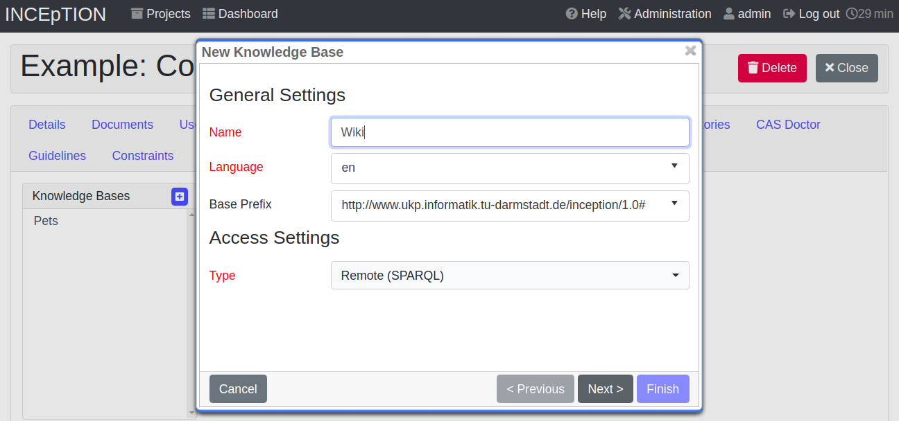

NOTE: *Knowledge Bases* are data bases for knowledge.
Let's assume, the mention "`Paris`" is to be annotated.
There are many different Parises - persons, the capital city of France and more - so the annotation is to tell clearly what entity with the name "`Paris`" is meant here.
Herefore, the knowledge base needs to have an entry of the correct entity.
In the annotation, we then want to make a reference to that very entry. +
There are knowledge bases on the web (“remote”) which can be used with {product-name} like e.g. WikiData.
You can also create your own, new knowledge bases and use them in {product-name}.
They will be saved on your device (“local”).

* *Note* that you can have several knowledge bases in your INCEpTION instance but you can choose for every project which one(s) to use.
Using many little knowledge bases in one project will slow down the performance more than few big ones.
* Via the Dashboard (click the Dashboard-button at the top centre), you get to the *knowledge base page*.
This is a page different from the one in the project settings where you can modify and work on your knowledge bases.
+
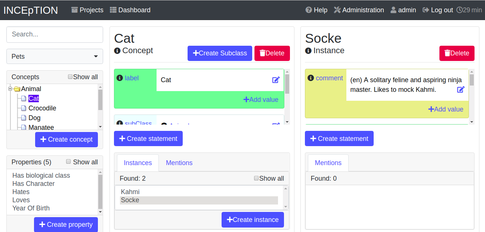
+

* *For details* on knowledge bases, see our main documentation on <<Knowledge Base>>s, or our https://www.youtube.com/watch?v=wp4AN3p23mQ&list=PL5Hz5pttaj96SlXHGRZf8KzlYvpVHIoL-&index=3&t=0s../[tutorial video “Overview“^] mentioning knowledge bases.

* If you like to explore a knowledge base check the example project we have downloaded and imported before.
It contains a small knowledge base, too.

[[recommenders_in_getting_started]]
=== Recommenders
In this section, you can create and modify your recommenders.
They learn from what the user annotates and give suggestions.
For details on how to _use_ recommenders, see our main documentation on xref:sect_annotation_recommendation[Recommenders] in the Annotation section.
For details on _how to create and adjust_ them, see xref:sect_projects_recommendation[Recommenders] in the Projects section.
Or check the https://www.youtube.com/watch?v=Xz3Hs8Lyoeg&list=PL5Hz5pttaj96SlXHGRZf8KzlYvpVHIoL-&index=3/[tutorial video “Recommender Basics”^].

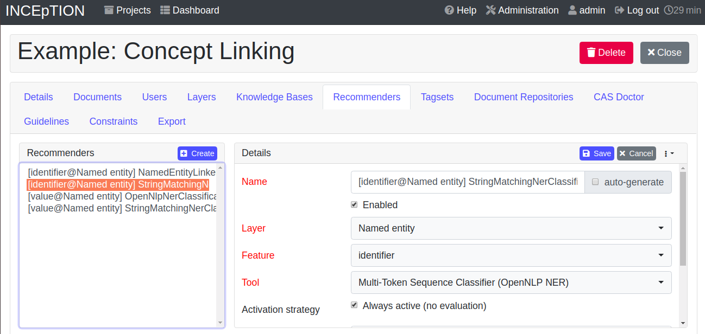

=== Guidelines
In this section, you may import files with annotation guidelines.
There is no automatic correction or warning from {product-name} if guidelines are violated but it is a short way for every user in the project to read and check the team guidelines while working.
On the annotation page (→ _Dashboard_ → _Annotation_ → open any document), annotators can quickly look them up by clicking on the guidelines button on the top which looks like a book (this button only appears if at least one guideline was imported).

image::images/getting_started_guidelines.png[align="center"]

[[export_in_getting_started]]
=== Export
In this section, you can export your project partially or wholly.
Projects which have been exported can be imported again in INCEpTION the way we did with our example project in section <<Download and import an Example Project>>: at the start page with the *Import* button.
We recommend exporting projects on a regular basis in order to have a backup.
For the different formats, their strengths and weaknesses, check the main documentation, xref:sect_formats[Appendix A: Formats].
We recommend using _WebAnno TSV x.x_ (where "`x.x.`" is the highest number available, e.g. 3.2) whenever possible.
Since it has been created specially for this application, it will provide all features required.
However, many other formats are provided.

[[sect_intro_structure]]
== Structure of an Annotation Project

Here, we will find out what you can _do_ in each project having a look at the <<Structure of an Annotation Project>>. Therefore, we examine the dashboard.

If you are in a project already, click on the dashboard button on the top to get there.
If you just logged in, choose a project by clicking on its name.
As you are a Project Manager (see xref:Project_roles[Project Roles]), you see all of the following sub pages.
For details on each section, check the section on <<sect_core_funct, Core Functionalities>>.

=== Annotation
If you went to <<First Annotations with {product-name}>> before, you have been here already.
Here, the annotators can go to annotate the texts.

=== Curation
Everyone with curation rights (see xref:Project_roles[Project Roles]) within a project can curate it.
All other users do not have access to nor see this page.
Only documents marked as finished by at least one annotator can be curated.
For details on how to curate, see the main documentation -> xref:sect_curation[Curation] or just try it out:

NOTE: *Curation:* If several annotators work on a project, their annotations usually do not match perfectly.
During the process called "Curation", you decide which annotations to keep in the final result.

* Create some annotations in any document
* Mark the document as finished: Just click on the lock on top.
* Add another user, just for testing this (see xref:users_in_getting_started[Users] in the section <<Project Settings>>).
* Log out and log in again as the test user.
* In the very same document, make some annotations which are the same and some which are different than before.
Mark the document as finished.
* Log in as any user with the curator role (e.g. as the "`admin`" user we used before), enter the curation page and explore how to curate: You see the automatic merge on top (what both users agreed on has been accepted already) and the annotations of each of the users below.
Differences are highlighted.
You can accept an annotation by clicking on it.

image::images/getting_started_curation.png[align="center"]

* As a curator, you can also create new annotations on this page.
It works exactly like on the Annotation page.
Note that users who have nothing but curation roles do not see nor have access to the annotation page (see xref:Project_roles[Project Roles]).

[[knowledge_bases_in_getting_started_in_structrue]]
=== Knowledge Base
Also see xref:knowledge_bases_in_getting_started[the section on knowledge bases in the project settings].
On the Knowledge Base page, you can manage and create your knowledge base(s) for the project you are in.
You can create new knowledge bases from scratch, modify them and integrate existing knowledge bases into your project which are either local (that is, they are saved on your device) or remote (that is, they are online).
Note that this knowledge base page is distinct from the tab of the same name in the project settings (see xref:knowledge_bases_in_getting_started[Knowledge Base in section Project Settings]).

=== Agreement
On this page, you can calculate the annotator agreement.
*_Note:_* Only documents *marked as finished* by annotators (clicking on the little lock on the annotation page) are taken into account.

NOTE: *Agreement:* The annotations of different annotators usually do not match perfectly.
This aspect of difference / similarity is called agreement.
For agreement, some common measures are provided.

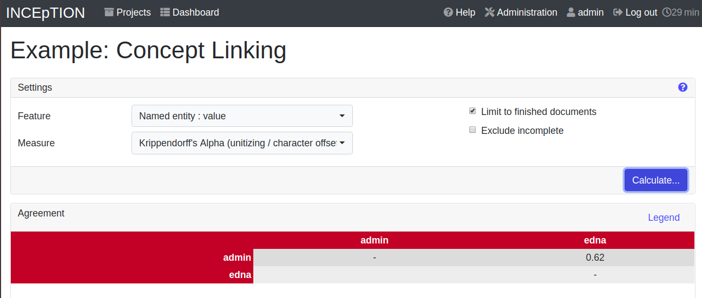

=== Workload
Here you can check the overall progress of your project; see which user is working on or has finished which document; and toggle for each user the status of each document between *Done / In Progress* or between *New / Locked*.
For details, see <<sect_workload>> in the main documentation.

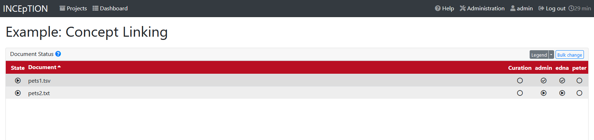

=== Settings
Here, you can organize, manage and adjust all the details of your project.
We had a look at those you need to get started for your own projects in the section <<Project Settings>> already.

This was the overview on what you can _do_ in each project and what elements each project _has_.
Now you are ready to go for your own annotations.

== First Annotations with {product-name}

In this section, we will make our first annotations.
If you have not downloaded and imported an example project yet, we recommend to return to <<Download and import an Example Project>> and do so first.
In this section, no or little theory and background will be explained.
In case you want to have some theory and background knowledge first, we recommend reading the section <<Structure of an Annotation Project>>.

*Create your first annotations*

This will lead you step by step.
You also may want to watch our https://www.youtube.com/watch?v=wp4AN3p23mQ&list=PL5Hz5pttaj96SlXHGRZf8KzlYvpVHIoL-&index=3&t=0s[tutorial video „Overview“^] on how to create annotations.
We will create a Named Entity annotation which tells whether a mention is a person (PER), location (LOC), organization (ORG) or other (OTH):

NOTE: *Creating your own Projects:* In this guide, we will use our example project.
If you would like to create your own project later on, click on *create*, enter a project name and click on *save*.
Use the *Projects* link at the top of the screen to return to the project overview and select the project you just created to work with it.
See <<Project Settings>> in order to add documents, users, guidelines and more to your project.

*Step 1 - Opening a Project:* After logging in, what you see first is the *Project overview*.
Here, you can see all the projects which you have access to.
Right now, this will be only the example project.
Choose the example project by clicking on its name and you will be on the *Dashboard* of this project.

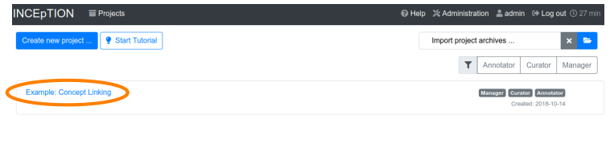

NOTE: *Instructions to Example Projects:* In case of the example project, on the dashboard you also find instructions how to use it.
This goes for all our example projects.
You may use it instead of or in addition to the next steps of this guide. +
In case of your own projects, you will find the description you have given it instead.

*Step 2 - Open the Annotation Page:* In order to annotate, click on *Annotation* on the top left.
You will be asked to open the document which you want to annotate.
For this guide, choose _pets1.tsv_.

NOTE: *Annotations in newly imported Projects:* In the example project, you will see several annotations already.
If you import projects or single documents (see xref:documents_in_getting_started[Documents]) without any annotations, there will be none.
But in the example projects, we have added some annotations already as examples.
If you export a project (see  xref:export_in_getting_started[Export]) and import it again (as we just did with the example project in <<Download and import an Example Project>>), there will be the same annotations as before.

*Step 3 - Create an Annotation:* After opening the document, select *Named entity* from the *Layer* dropdown menu on the right side of the screen to create your first annotation.
Then, use the mouse to select a word in the annotation area, e.g. _in my home_ in line one.
When you release the mouse button, the annotation will immediately be created and you can edit its details in the right sidebar (see next paragraph).
These "`details`" are the features we mentioned before.

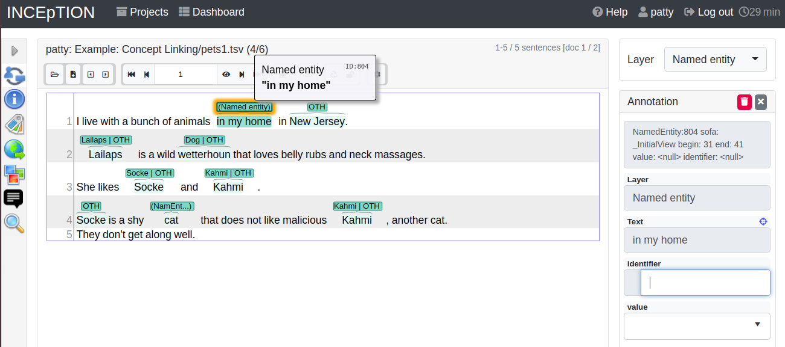

*_Note:_* All annotations will be saved automatically without clicking an extra save-button.

*Congratulations, you have created your first annotation!*

Now, let‘s examine the right panel to edit the details or to be precise: the features.
You find the panel named _Layer_ on top and _Annotation_ below.

In the *Layer*-dropdown, you can choose the layer you want to annotate with as we just did.
You always have to choose it before you make a new annotation.
After an annotation has been created, its layer cannot be changed any more.
In order to change it, you need to delete it, select the right layer and create a new annotation.

If you are not sure what layers are, check xref:box_layers_and_features_in_getting_started[the box on _Layers and Features_ in the section Project Settings].
In order to learn how to adjust and create them for your purpose, see section <<Layers>> in the main documentation.

In the *Annotation* panel, you see the details of a selected annotation.
They are called features.

image::images/getting_started_annotation_panel.png[align="center"]

It shows the layer the annotation is made in (field _Layer_; here: _Named entity_) and what part of the text has been annotated (field _Text_; here _in my home_).
Below, you can see and modify what has been entered for each of the so-called *Features*.
If you are not sure what features are, check xref:box_layers_and_features_in_getting_started[the box on _Layers and Features_ in the section Project Settings] (Here: The layer _Named entity_ (see xref:named_entity_recognition_in_getting_started[the note box on Named Entity]) has the features _identifier_ and _value_.
The *identifier* tells, to which entity in the knowledge base the annotated text refers to.
For example, in case the home referred to here is a location the knowledge base knows, you can choose it in the dropdown of this field.
The *value* tells if it is a Location (LOC) like here, a Person (PER), Organization (ORG) or any other (OTH).). +
You may enter free text here or work with tagsets to have a well defined set of labels to enter so all of the users within one project will use the same labels.
You can modify and create tagsets in the project settings.
See section xref:tagsets_in_getting_started[Tagsets] in _Getting Started_ or check the main documentation for <<Tagsets>>.

You have almost finished the _Getting Started_.
One word can still be said about the *Sidebars* on the left. These offer access to various 
additional functionalities such as an annotation overview, search, recommenders, etc. Which 
functionalities are available to you is determined by the project settings. The sidebars can be
opened by clicking on one of the sidebar icons and they can be closed by clicking on the arrow icon at the top.

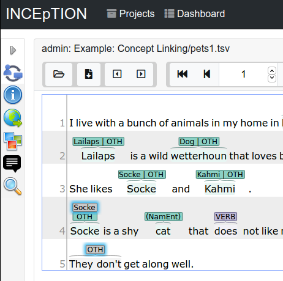

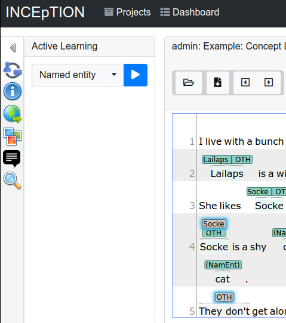

There are several features you might want to check the main documentation for.
Especially the *Recommender* section of the sidebar (the black speech bubble) is worth a look in case you use recommenders (see xref:recommenders_in_getting_started[Recommenders in the section Project Settings]).
Amongst others, you will find their measures and learning behaviours here.
Also note the *Search* in the sidebar (the magnifier glass): You can create or delete annotations on all or some of the search results.

To get familiar with {product-name}, you may want to follow the instructions for other example-projects, read more in-depth explanations on its <<sect_core_funct, Core Functionalities>> or explore {product-name} yourself, learning by doing.

One way or the other: *Have fun exploring*!

== Thank You

We hope the _Getting Started_ helped you with your first steps in {product-name} and gave you a general idea of how it works.
For further reading and more details, we recommend the <<sect_core_funct, main documentation>>, starting right after this paragraph.

Do not hesitate to xref:do_you_have_questions_or_feedback[contact us] if you struggle, have any questions or special requirements.
We wish you success with your projects and you are welcome to let us know what you are working on.