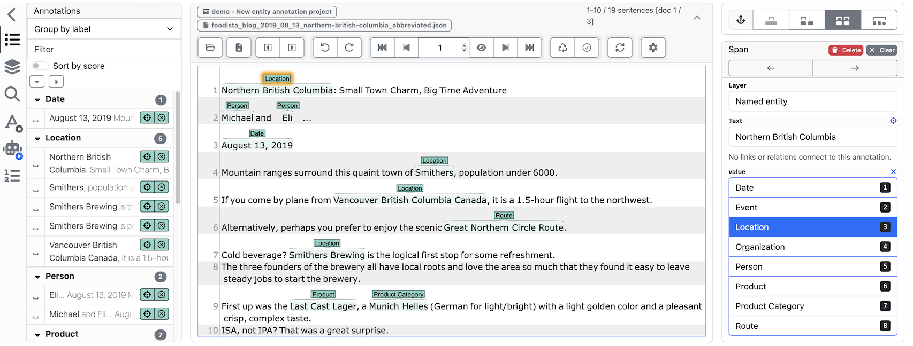
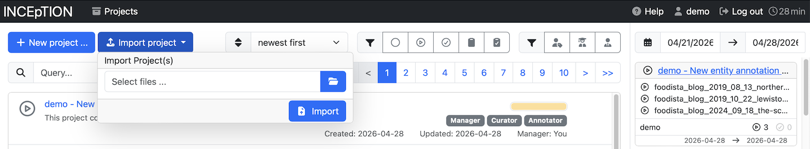

// Licensed to the Technische Universität Darmstadt under one
// or more contributor license agreements.  See the NOTICE file
// distributed with this work for additional information
// regarding copyright ownership.  The Technische Universität Darmstadt
// licenses this file to you under the Apache License, Version 2.0 (the
// "License"); you may not use this file except in compliance
// with the License.
//
// http://www.apache.org/licenses/LICENSE-2.0
//
// Unless required by applicable law or agreed to in writing, software
// distributed under the License is distributed on an "AS IS" BASIS,
// WITHOUT WARRANTIES OR CONDITIONS OF ANY KIND, either express or implied.
// See the License for the specific language governing permissions and
// limitations under the License.

[[sect_intro_first_annotations]]
= First annotations

When you first log in, you will be greeted with the project creation dialog.
A good way to get started is clicking on the *Entity annotation* template,
which will create a project with some example documents and annotations.
You can always bring up this dialog again by clicking the *Create new project* button on the start page.

The project will open in the dashboard, which is the central hub for all project-related activities. The dashboard provides access to various sections of the project, such as annotation, curation, and knowledge base management.

== Open the annotation page
Click on the *Annotation* section in the left sidebar to start annotating the documents. The first two documents already contain some example annotations, while the third document is empty and ready for you to work on.

.Annotation schema
The project is set up for a simple named entity recognition task, where you mark up mentions of people, places, organisations, and other entities in the text.

It includes one **span layer** called *Named entity* with one feature called *value*.

The *value* feature is linked to the following tagset:

[cols="1,3", options="header"]
|===
| Tag | Use it for

| Date             | A calendar date or time expression (e.g. _August 13, 2019_).
| Event            | A happening or occurrence (e.g. conferences, festivals, incidents).
| Location         | A place or geographic location (city, landmark, address).
| Organization     | A company, institution, agency, or group.
| Person           | An individual's name.
| Product          | A named commercial item or specific product.
| Product Category | A class or category of products (e.g. _IPA_, _smartphone_).
| Route            | A named travel path or route (road, trail, transit line).
|===

Each tag has a number-key shortcut (`1`-`8`), so once you have selected a
piece of text you can press the matching number to assign a tag without
reaching for the mouse.

.Annotation suggestions
Also, the project includes a pre-configured recommender which suggests annotations
based on the already annotated documents.

== Create your first annotations

To create an annotation:

. Select a span of text with the mouse (e.g. a city name).
. The annotation is created immediately and a detail panel appears on the right.
. Pick a tag from the radio buttons, or press the corresponding number key
  (`1`-`8`).

Annotations are saved automatically — there is no save button to click.

After you have annotated a few examples, the *recommender* will start to
suggest further annotations based on what you have already marked. Suggestions
appear in grey in the text:

* A *single click* on a suggestion accepts it and turns it into a real annotation.
* A *double click* rejects the suggestion so it will not be shown again.

== Around the annotation page

When you select an annotation, a detail panel opens on the right. The top of
the panel shows which *layer* the annotation belongs to (here: *Named entity*)
and the text it covers. Below that, the *features* of the annotation are
listed — for the Entity annotation project, this is just the *value* feature
where you pick a tag.

The bar on the left side of the annotation page provides additional tools
such as an annotation overview, a search across the document, and a panel
showing recommender suggestions. Click an icon to open the corresponding
sidebar; click the arrow at the top to close it again.

[[sect_intro_more_example_projects]]
== More example projects

Beyond the *Entity annotation* template, additional example projects covering
other annotation tasks are available on our
https://inception-project.github.io/example-projects/[example projects page^].

To try one of them:

. Download the project archive from the example projects page (do not extract it).
. On the {product-name} start page, click *Import project* (next to *Create new project*).
. Select the downloaded file and click *Import*.

The project is then added to your project list and you can open it just like
the *Entity annotation* project you created above.

