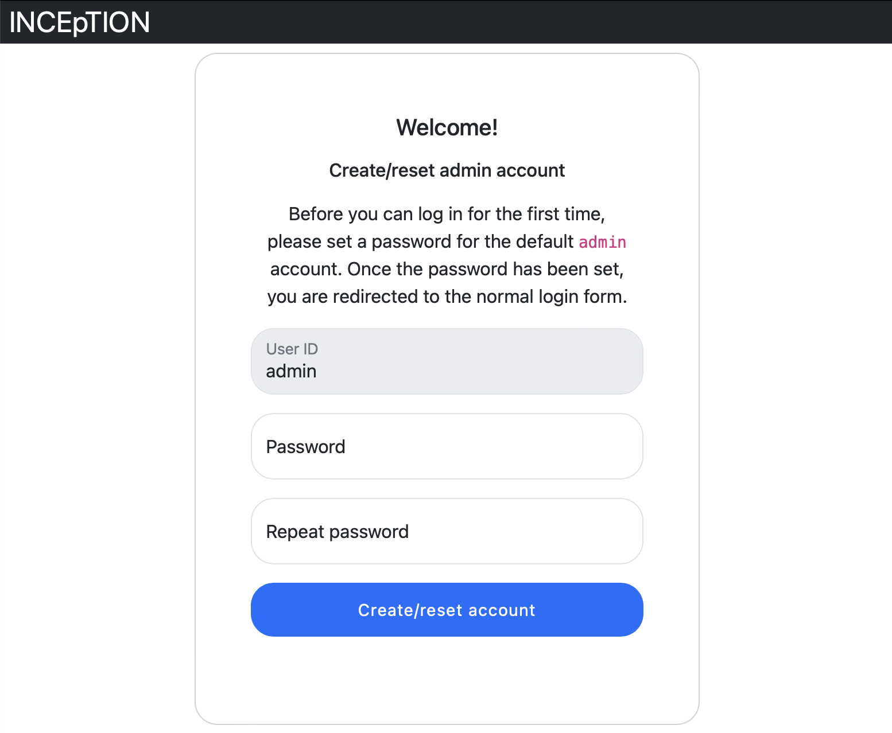

// Licensed to the Technische Universität Darmstadt under one
// or more contributor license agreements.  See the NOTICE file
// distributed with this work for additional information
// regarding copyright ownership.  The Technische Universität Darmstadt
// licenses this file to you under the Apache License, Version 2.0 (the
// "License"); you may not use this file except in compliance
// with the License.
//
// http://www.apache.org/licenses/LICENSE-2.0
//
// Unless required by applicable law or agreed to in writing, software
// distributed under the License is distributed on an "AS IS" BASIS,
// WITHOUT WARRANTIES OR CONDITIONS OF ANY KIND, either express or implied.
// See the License for the specific language governing permissions and
// limitations under the License.

[[sect_intro_first_login]]
= First login

The first time you start {product-name}, you are asked to set a password for
the default *admin* user. The password must be entered into two separate
fields and is only accepted when both entries match.

Once the password has been set, you are redirected to the regular login
screen. Log in with the username *admin* and the password you have just set.

NOTE: *Working with the latest version:* We recommend to always work with the latest version since we constantly add new features, improve usability and fix bugs.
      After downloading the latest version, your previous work will not be lost:
      within a new version you will generally find all your projects, documents, users etc. like before without doing anything.
      However, please consult the release notes on this beforehand.
      To be notified when a new version has been released, please check the website, subscribe to Github notifications or the Google group (see <<Do you have questions or feedback?>>).
