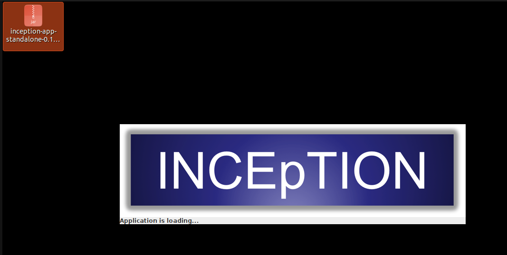
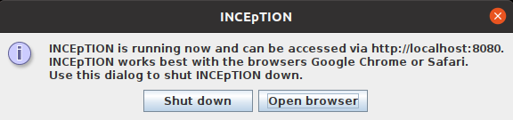

// Licensed to the Technische Universität Darmstadt under one
// or more contributor license agreements.  See the NOTICE file
// distributed with this work for additional information
// regarding copyright ownership.  The Technische Universität Darmstadt
// licenses this file to you under the Apache License, Version 2.0 (the
// "License"); you may not use this file except in compliance
// with the License.
//
// http://www.apache.org/licenses/LICENSE-2.0
//
// Unless required by applicable law or agreed to in writing, software
// distributed under the License is distributed on an "AS IS" BASIS,
// WITHOUT WARRANTIES OR CONDITIONS OF ANY KIND, either express or implied.
// See the License for the specific language governing permissions and
// limitations under the License.

[[sect_installation]]
= Installation

This section is directed towards users running {product-name} on their own
machine for single-user use. There are two ways to install it:

* The *native desktop installers* for Windows (`.msi`) and macOS (`.dmg`)
  are the recommended option for most users. They include a Java runtime,
  so no separate Java installation is required, and they integrate with the
  Start Menu / Applications folder. You will still access {product-name}
  through your web browser, but the desktop bundle takes care of starting
  the server and opening the browser for you.
* The *platform-independent JAR* can be used on Linux or any other system
  with a Java runtime, or when you prefer to start {product-name} from the
  command line.

NOTE: *Hey system operators and admins!* If you are installing {product-name}
      for someone else, for a group of users on a server, or want to perform a
      Docker-based deployment — or need information on more advanced topics
      such as logging, monitoring, or backup — please skip this section and
      go directly to the <<admin-guide.adoc#sect_installation_server, Admin Guide>>.

== Windows (MSI)

. Download the `{product-name}-{revnumber}-x86_64.msi` file from the
  link:https://inception-project.github.io/downloads/[downloads page].
. Double-click the installer and follow the prompts. By default,
  {product-name} is installed under `C:\Program Files\INCEpTION` and a
  Start Menu shortcut is created.
. Launch *{product-name}* from the Start Menu. The application opens its main
  page in your default browser once the server has started.

== macOS (DMG)

. Download the appropriate `{product-name}-{revnumber}-<arch>.dmg` for your
  Mac (`aarch64` for Apple Silicon, `x86_64` for Intel).
. Open the DMG and drag *{product-name}* into the *Applications* folder.
. Launch *{product-name}* from Launchpad or the *Applications* folder. The
  application opens its main page in your default browser once the server
  has started.

== Linux / platform independent (JAR)

The platform-independent JAR requires Java 21 or higher to be installed on
your system. If you do not have Java installed, you can obtain it for example
from link:https://adoptium.net[Adoptium].

. Download the `inception-app-standalone-{revnumber}.jar` file from the
  link:https://inception-project.github.io/downloads/[downloads page].
. Start {product-name} by double-clicking the downloaded JAR file.
  A splash screen is shown while the application is loading.
+
[.right]

+
NOTE: *In case {product-name} does not start:* If double-clicking the JAR file
does not start {product-name}, you might need to make the file executable first.
Right-click on the JAR file and navigate through the settings and permissions.
There, you can mark it as executable.
+
Alternatively, you can start the application from the command line:
+
[source,text]
----
$ java -jar inception-app-standalone-{revnumber}.jar
----
. Once the application has started, a dialog appears from which you can open
  the application in your default browser or shut it down again. When started
  from the command line, no dialog is shown — open
  http://localhost:8080/[_http://localhost:8080_] in your browser instead.
+

