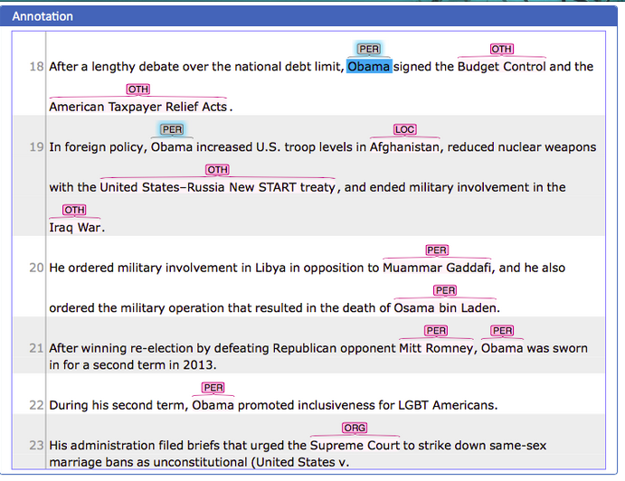

// Licensed to the Technische Universität Darmstadt under one
// or more contributor license agreements.  See the NOTICE file
// distributed with this work for additional information
// regarding copyright ownership.  The Technische Universität Darmstadt
// licenses this file to you under the Apache License, Version 2.0 (the
// "License"); you may not use this file except in compliance
// with the License.
//
// http://www.apache.org/licenses/LICENSE-2.0
//
// Unless required by applicable law or agreed to in writing, software
// distributed under the License is distributed on an "AS IS" BASIS,
// WITHOUT WARRANTIES OR CONDITIONS OF ANY KIND, either express or implied.
// See the License for the specific language governing permissions and
// limitations under the License.

= Introduction

{product-name} is a *text-annotation environment* for annotation tasks on written text.
It is a web application: several users can work on the same project, and an instance can host many projects in parallel.
A built-in recommender system suggests annotations as you work, and *curation* tools help reconcile the annotations of multiple annotators into a single result.
Beyond annotating, you can build corpora by searching xref:documents_in_getting_started[external document repositories], and link annotations to xref:knowledge_bases_in_getting_started[knowledge bases] for tasks such as entity linking.

[.right]

The picture on the right shows {product-name} in action: text xref:layers_and_features_in_getting_started[spans] have been marked as person (PER), location (LOC), organization (ORG), or other (OTH).

{product-name} is designed to be adapted to your task.
Built-in xref:layers_and_features_in_getting_started[layers], xref:tagsets_in_getting_started[tagsets], and xref:knowledge_bases_in_getting_started[knowledge bases] give you a starting point, but you can modify them or define your own from scratch — including custom xref:recommenders_in_getting_started[recommenders] that learn from your annotations and speed up the work.

This _Getting Started_ guide takes about 20-30 minutes to read and walks you through the first steps:

. <<sect_installation,Installation>> — install and start {product-name} on your machine.
. <<sect_intro_first_login,First login>> — set the admin password and log in.
. <<sect_intro_first_annotations,First annotations>> — create a project from the *Entity annotation* template and annotate.
. <<sect_intro_structure,What else you can do in a project>> — tour the project dashboard.
. <<sect_intro_settings,How to customize your project>> — work through the project settings.

For more depth on any topic, the main documentation starts right after _Getting Started_: <<sect_core_funct,Core Functionalities>>.

TIP: Short video walkthroughs are available on our https://www.youtube.com/playlist?list=PL5Hz5pttaj96SlXHGRZf8KzlYvpVHIoL-[YouTube playlist^] — covering an https://www.youtube.com/watch?v=Ely8eBKqiSI&list=PL5Hz5pttaj96SlXHGRZf8KzlYvpVHIoL-&index=1[Introduction^], an https://www.youtube.com/watch?v=wp4AN3p23mQ&list=PL5Hz5pttaj96SlXHGRZf8KzlYvpVHIoL-&index=2[Overview^], https://www.youtube.com/watch?v=Xz3Hs8Lyoeg&list=PL5Hz5pttaj96SlXHGRZf8KzlYvpVHIoL-&index=3[Recommender Basics^], and https://www.youtube.com/watch?v=p5SQq5W1rQI&list=PL5Hz5pttaj96SlXHGRZf8KzlYvpVHIoL-&index=4[Entity Linking^].

[[do_you_have_questions_or_feedback]]
== Questions or feedback?

{product-name} is under active development. Feedback, feature requests, and bug reports are welcome:

* For most questions, the *main documentation* has the answer: <<sect_core_funct,Core Functionalities>>. In the application itself, click any *blue question mark* to jump to the matching section.
* Join the *Google group* https://groups.google.com/forum/#!forum/inception-users[inception-users^] (mailing list: inception-users@googlegroups.com).
* Open an issue on https://github.com/inception-project/inception/issues[GitHub^].

== Further reading

The full documentation consists of three guides:

* *User Guide* — for everyone who uses {product-name}. The main part starts right after this _Getting Started_ section: <<sect_core_funct,Core Functionalities>>.
* *Admin Guide* — for setting up {product-name} on a server for multiple users, plus advanced topics like logging, monitoring, and backup. See the https://inception-project.github.io/documentation/latest/admin-guide[Admin Guide^].
* *Developer Guide* — for contributors. {product-name} is open source; see the https://inception-project.github.io/documentation/latest/developer-guide[Developer Guide^].

All materials are available from the link:{product-website-url}[{product-name} homepage^].
