// Licensed to the Technische Universität Darmstadt under one
// or more contributor license agreements.  See the NOTICE file
// distributed with this work for additional information
// regarding copyright ownership.  The Technische Universität Darmstadt
// licenses this file to you under the Apache License, Version 2.0 (the
// "License"); you may not use this file except in compliance
// with the License.
//
// http://www.apache.org/licenses/LICENSE-2.0
//
// Unless required by applicable law or agreed to in writing, software
// distributed under the License is distributed on an "AS IS" BASIS,
// WITHOUT WARRANTIES OR CONDITIONS OF ANY KIND, either express or implied.
// See the License for the specific language governing permissions and
// limitations under the License.

[[sect_intro_settings]]
= How to customize your project

The *Project Settings* page is where you adjust the elements that make up a project. Each project has at least:

* one or more xref:documents_in_getting_started[Documents] to annotate
* one or more xref:users_in_getting_started[Users] working on it
* one or more xref:layers_and_features_in_getting_started[Layers] to annotate with

and optionally: xref:tagsets_in_getting_started[Tagsets], xref:knowledge_bases_in_getting_started[Knowledge Bases], xref:recommenders_in_getting_started[Recommenders], and xref:guidelines_in_getting_started[Guidelines].

To open the settings, click your project name on the start page and then *Settings* on the left. The chapter below walks through the most important tabs using the *Entity annotation* template project from <<sect_intro_first_annotations,First annotations>>.

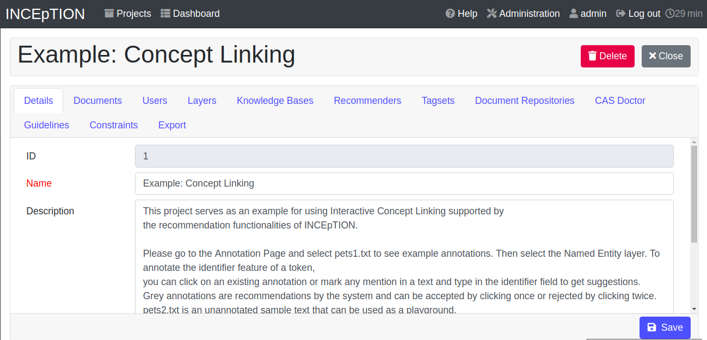

[[documents_in_getting_started]]
== Documents

Upload the files you want to annotate here. Make sure the *format* dropdown on the right matches the file you are uploading.

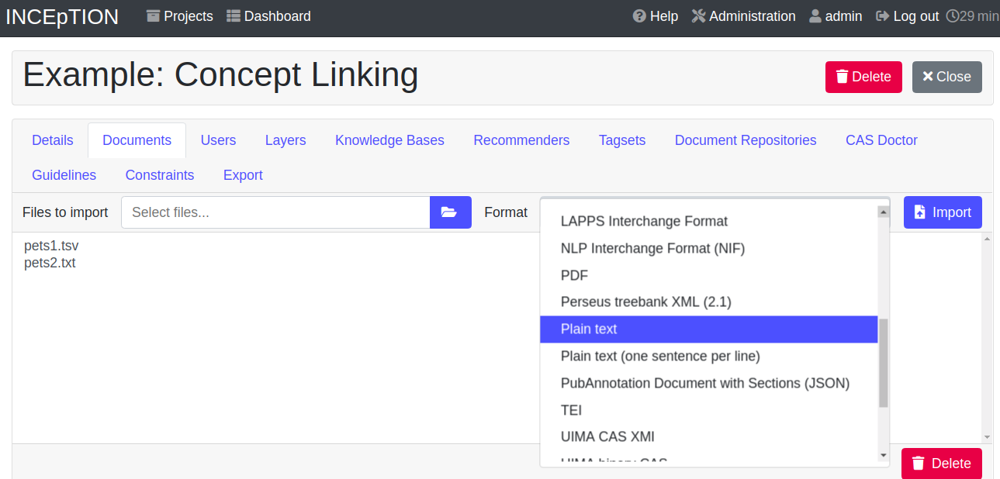

For the full list of supported import and export formats, see xref:sect_formats[Appendix A: Formats].

NOTE: *{product-name} instance vs. project:* It is worth distinguishing between the {product-name} *instance* (the installation as a whole) and the *projects* it contains.
A user may exist in the instance without belonging to a given project, and may hold different roles in different projects.

[[users_in_getting_started]]
== Users

Add users to the project and assign their roles. The dropdown on the left only shows users who already exist in the {product-name} *instance* — that is, the installation as a whole.

To create a new instance user, click the *administration* button in the top-right corner and open the xref:sect_users[Users] section. That section also documents the available instance-level roles.

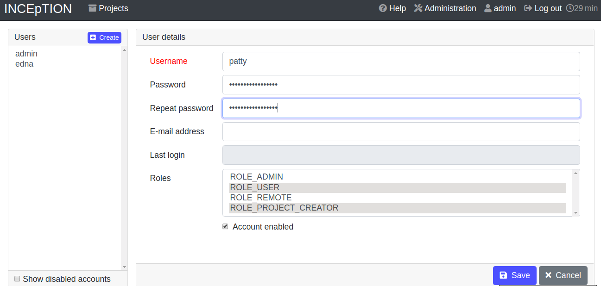

Once a user is in the dropdown, select them and tick the project roles to assign on the right. Project roles only apply within this project — they are independent from instance roles. See <<Project_roles,Project roles>> for what each role can do.

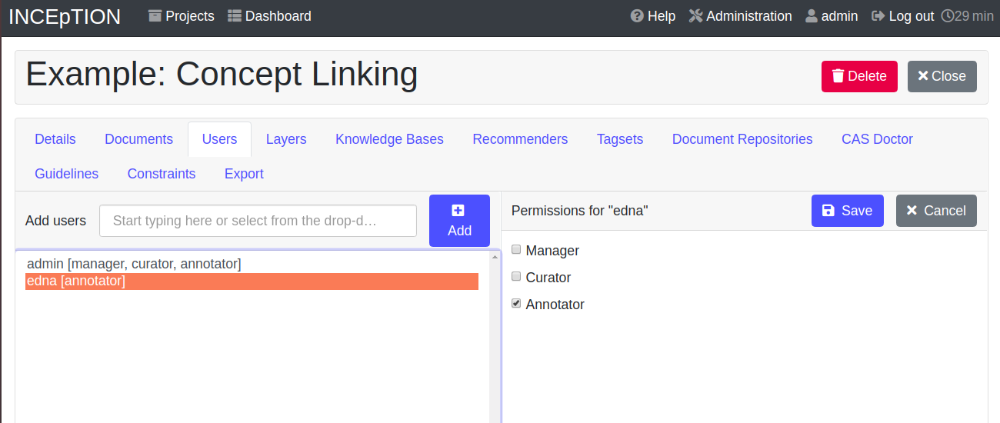

[[layers_and_features_in_getting_started]]
== Layers and features

A *layer* is one aspect or category you want to annotate — for example *Named Entity*, or *Part of Speech*. {product-name} ships with built-in layers and lets you create custom ones.

There are three layer kinds:

* *Span layers* attach to a span of text. The default is one or more tokens, but the granularity can be set to character or sentence level in the layer's <<sect_projects_layers_properties,Properties>>.
* *Relation layers* connect two span annotations.
* *Chain layers* group multiple spans, typically for coreference.

Each layer has *features* — fields that hold the actual labels. The *Named entity* layer in the Entity annotation project, for example, has a *value* feature for the entity type (LOC, PER, ORG, ...) and an *identifier* feature for linking to a knowledge base entry.

Built-in layers cannot be deleted, but you can add features to them. Custom layers can be modified or deleted freely. For details, see <<sect_projects_layers,Layers>> and <<sect_projects_layers_features,Features>> in the main documentation.

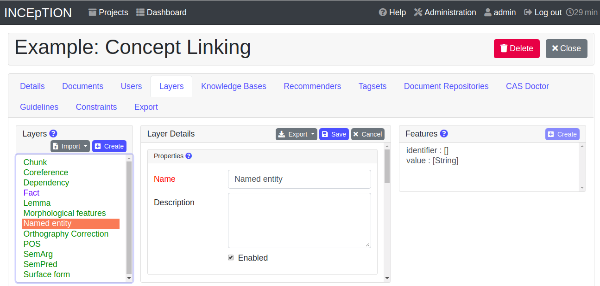

[[tagsets_in_getting_started]]
== Tagsets

A *tagset* is a fixed list of labels that can be assigned to a feature. Using tagsets keeps annotations consistent — different annotators don't end up using `LOCATION`, `Loc`, and `location` for the same thing. {product-name} ships with predefined tagsets you can use as-is, modify, or replace with your own.

Tagsets are bound to a specific *feature* of a layer, and a tagset must have a type compatible with that feature. The most common feature type is *Primitive: String*; others include *Primitive: Integer*, *Primitive: Boolean*, and *KB: Concept/Instance/Property* for features that link to a knowledge base. Built-in features have a fixed type; custom features can be retyped from the *Feature Details* panel on the *Layers* tab.

The walkthrough below creates a new tagset, links it to the *Named entity* layer, and tries it out:

*1. Create the tagset.* Click the blue *Create* button on the *Tagsets* tab. Enter a name (e.g. `Example_Tagset`) and a description. Decide whether annotators should be allowed to add new tags. Click *Save*.

*2. Add tags.* Select the new tagset on the left, then click *Create* in the *Tags* panel. Add a tag named `CAT` with a description, and another named `DOG`. Each tag is saved when you click *Save*.

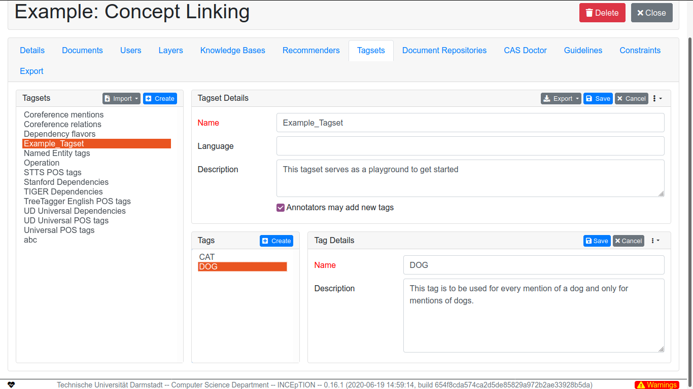

[[link_to_a_layer_and_feature]]
*3. Link the tagset to a feature.* Switch to the *Layers* tab. Select the *Named entity* layer, then the *value* feature in the *Features* panel. In *Feature details*, scroll to *Tagset*, pick `Example_Tagset` from the dropdown, and click *Save*. The previous tagset is no longer linked to this feature.

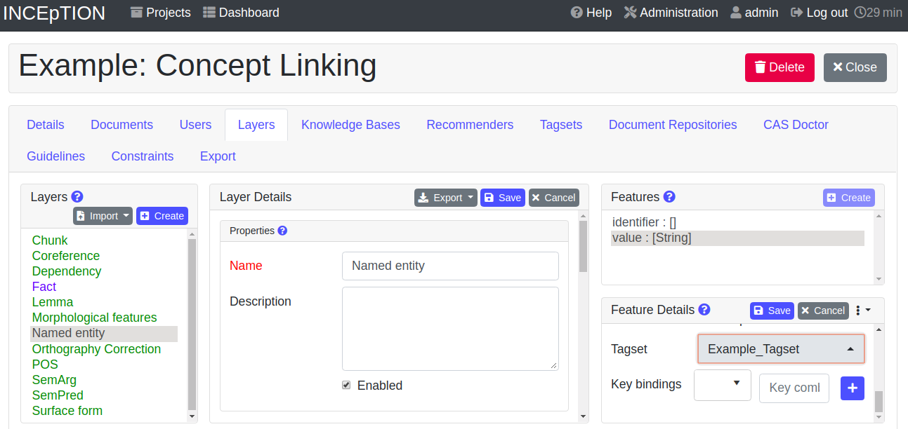

*4. Try it out.* Open the annotation page (top-left logo -> *Annotation* -> open any document) and select a span of text. The *value* dropdown of the *Named entity* layer now offers `CAT` and `DOG`.

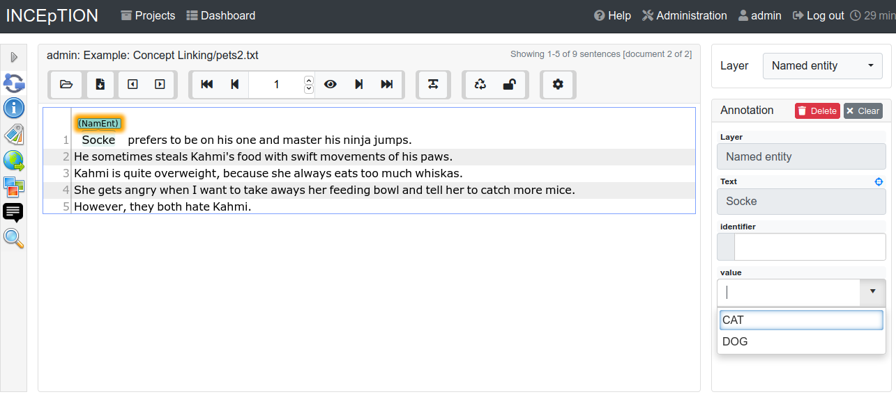

To restore the original behaviour, link the original *Named Entity tags* tagset back to the *value* feature.

Existing annotations keep their tag values even after the tagset is changed or deleted. Built-in tagsets — unlike built-in layers — *can* be deleted. For more, see <<sect_projects_tagsets,Tagsets>> in the main documentation.

NOTE: Some changes (annotations, recommender suggestions accepted) are saved automatically. Others require clicking the blue *Save* button — if you see one, you need to click it.

[[knowledge_bases_in_getting_started]]
== Knowledge Bases

This tab is where you add and configure knowledge bases for the project. You can attach an existing remote knowledge base (e.g. WikiData), import a local one, or create a new empty one. To create or import, click *Create* and follow the prompts.

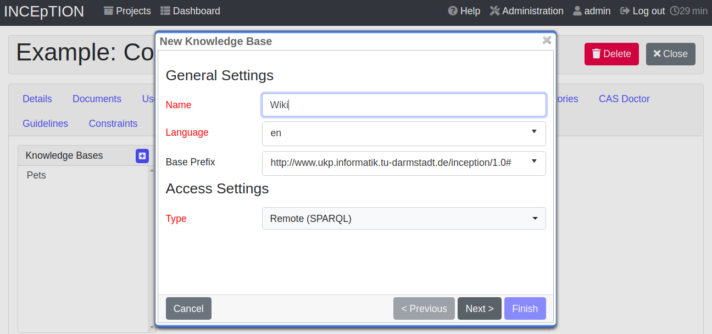

A *knowledge base* stores entities the annotations can refer to. For example, the mention "`Paris`" might mean the French capital, the person Paris Hilton, or a company. To disambiguate, the knowledge base needs an entry for each, and the annotation references that entry. Knowledge bases can be remote (used over the network, like WikiData) or local (stored on the {product-name} instance).

A few points worth knowing:

* An instance can have many knowledge bases, but each project picks which ones to use. Many small knowledge bases slow the project down more than a few large ones.
* The *Knowledge Base* tab in the *dashboard* (separate from this settings tab) is where you browse and edit the contents of a knowledge base. See xref:knowledge_bases_in_getting_started_in_structrue[Knowledge Base] in <<sect_intro_structure,What else you can do in a project>>.
* If you want to explore an example, create a new project from the *Entity linking (Wikidata)* template — it ships pre-configured with a remote knowledge base.

For details, see <<sect_knowledge_base,Knowledge Base>> in the main documentation, or the https://www.youtube.com/watch?v=wp4AN3p23mQ&list=PL5Hz5pttaj96SlXHGRZf8KzlYvpVHIoL-&index=3&t=0s[Overview tutorial video^].

[[recommenders_in_getting_started]]
== Recommenders

A *recommender* learns from your annotations and suggests new ones as you work. Suggestions appear in grey in the text — accept with a single click, reject with a double click.

This tab is where you create and configure recommenders. The *Entity annotation* project comes with one already set up.

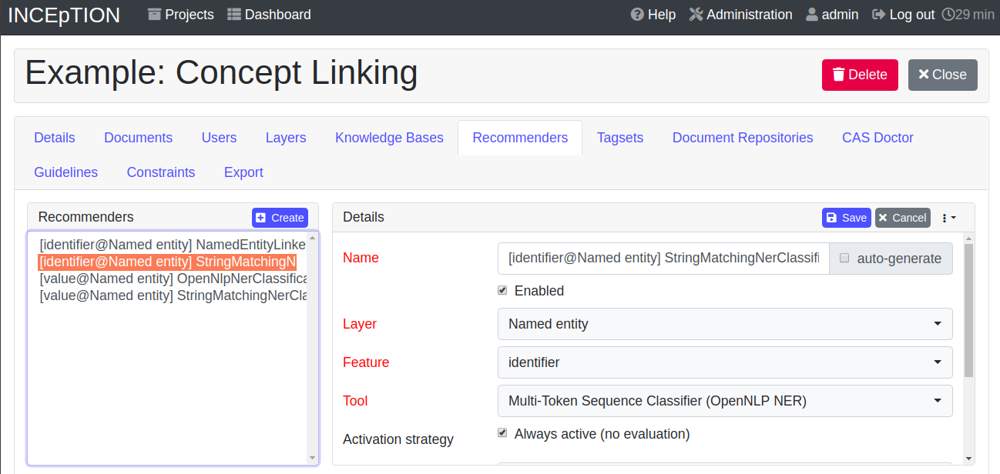

For how recommenders behave during annotation, see xref:sect_annotation_recommendation[Recommenders] in the Annotation section. For how to create and tune them, see xref:sect_projects_recommendation[Recommenders] in the Projects section. The https://www.youtube.com/watch?v=Xz3Hs8Lyoeg&list=PL5Hz5pttaj96SlXHGRZf8KzlYvpVHIoL-&index=3/[Recommender Basics tutorial video^] is a good starting point.

[[guidelines_in_getting_started]]
== Guidelines

Upload annotation guideline files here so annotators can read them while working. {product-name} does not enforce or validate guidelines automatically — they serve as a reference.

Annotators access guidelines from the annotation page (Dashboard -> Annotation -> open a document) by clicking the book icon at the top. The icon only appears once at least one guideline has been uploaded.

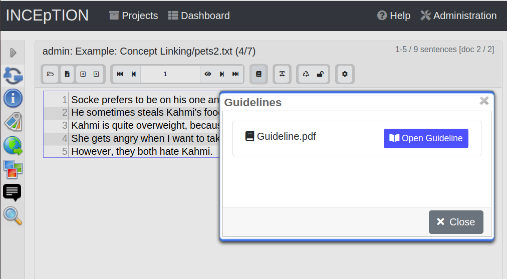

[[export_in_getting_started]]
== Export

Export the project, in whole or in part, from this tab. Exported projects can be re-imported via *Import project* on the start page (the same workflow as <<sect_intro_more_example_projects,More example projects>>). Exporting regularly is the easiest backup.

For the trade-offs of each format, see xref:sect_formats[Appendix A: Formats]. <<sect_formats_uimajson,*UIMA CAS JSON 0.4.0*>> is the recommended format when possible — it preserves all annotation data with full fidelity.
