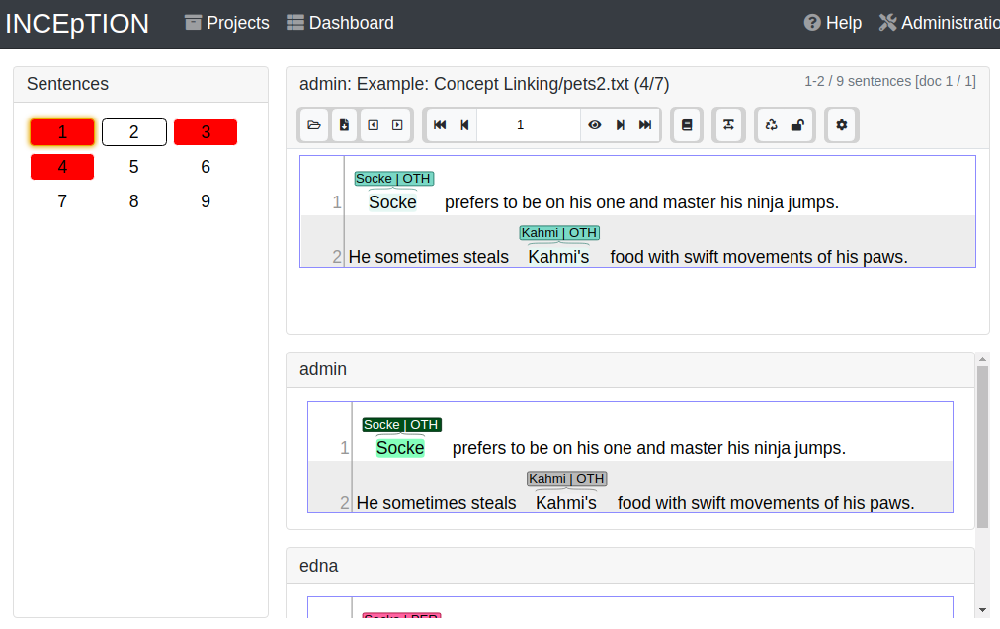
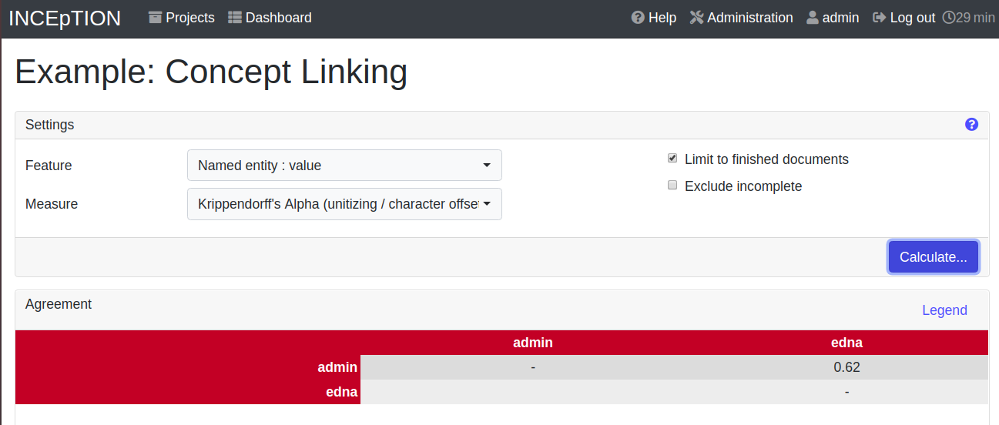
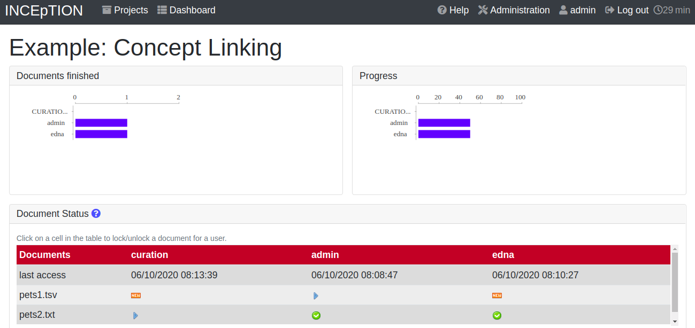

// Licensed to the Technische Universität Darmstadt under one
// or more contributor license agreements.  See the NOTICE file
// distributed with this work for additional information
// regarding copyright ownership.  The Technische Universität Darmstadt
// licenses this file to you under the Apache License, Version 2.0 (the
// "License"); you may not use this file except in compliance
// with the License.
//
// http://www.apache.org/licenses/LICENSE-2.0
//
// Unless required by applicable law or agreed to in writing, software
// distributed under the License is distributed on an "AS IS" BASIS,
// WITHOUT WARRANTIES OR CONDITIONS OF ANY KIND, either express or implied.
// See the License for the specific language governing permissions and
// limitations under the License.

[[sect_intro_structure]]
= What else you can do in a project

A project is more than just the annotation page. The *project dashboard* is the central hub: from there you can annotate, curate, manage knowledge bases, measure agreement, monitor progress, and adjust settings.

To open the dashboard, click the project name on the start page, or — if you are already inside a project — the dashboard button at the top.

[[Project_roles]]
Which sections you see depends on your *project roles*. You are logged in as the built-in administrator, which bypasses these checks and shows you every section. For regular users, the project roles grant access as follows:

[cols="2,1,1,1",options="header"]
|===
| Section | Annotator | Curator | Manager
| Annotation       | yes | yes (read-only) | -
| Curation         | -   | yes | -
| Knowledge Base   | yes | -   | -
| Agreement        | -   | yes | yes
| Workload         | -   | yes | yes
| Explorer         | -   | yes | yes
| Settings         | -   | -   | yes
|===

A user can hold any combination of these roles, and roles are scoped per project — a user may be an Annotator in one project and a Manager in another. In particular, a Manager is *not* automatically an Annotator or Curator: to also annotate or curate, the Manager role must be combined with the corresponding role. *Instance roles*, which apply to the whole {product-name} instance rather than a single project, are described in <<sect_users,User Management>>.

== Annotation

Where annotators mark up documents — the same page you used in <<sect_intro_first_annotations,First annotations>>.

== Curation

When several annotators work on the same document, their annotations rarely match exactly. *Curation* is the step where someone with the Curator role decides which annotations to keep in the final result. Only documents that at least one annotator has marked as finished are available for curation.

To try it out:

. Annotate a few items in a document and click the *lock icon* at the top to mark it finished.
. Add a second user via the xref:users_in_getting_started[Users] tab in the project settings.
. Log out, log in as that user, open the same document, make some matching and some differing annotations, and mark it finished.
. Log back in as a curator (e.g. _admin_) and open the xref:sect_curation[Curation] page. Annotations both users agree on are auto-merged at the top; differences are highlighted below. Click an annotation to accept it.

You can also create new annotations directly on the curation page; it works the same way as on the annotation page. Note that users who only have curation roles cannot access the annotation page.

[[knowledge_bases_in_getting_started_in_structrue]]
== Knowledge Base

The *Knowledge Base* page lets you browse and edit the knowledge bases attached to your project. You can create new ones, modify existing ones, or import remote (online) and local knowledge bases.

This is distinct from the *Knowledge Bases* tab in the project settings, which is for adding and configuring which knowledge bases the project uses. See xref:knowledge_bases_in_getting_started[Knowledge Bases] in <<sect_intro_settings,How to customize your project>>.

== Agreement

When several annotators work on the same document, their annotations rarely match exactly — the degree to which they do is called *inter-annotator agreement* and is a common quality measure for an annotation effort.
This page calculates agreement using a choice of established metrics.

== Workload

Shows overall project progress: which user is working on which document, and the status of each document per user. From here you can also toggle documents between *Done / In Progress* and *New / Locked*. See <<sect_workload>> for details.

== Explorer

The *Explorer* lets you analyze and correlate the annotations in your project by building a table: pick a *layer* and *feature* and add it as a row or column dimension, then click *Run*. By default the cells show how many annotations match each row/column combination, but the *Aggregator* dropdown can change this — for example, *Values + Count* shows the actual annotated text alongside the counts. Filters restrict the table to specific annotators or documents. See <<sect_explorer,Explorer>> for the full walkthrough.

== Settings

Where you organize, manage, and adjust everything in your project — documents, users, layers, recommenders, and more. The next chapter, <<sect_intro_settings,How to customize your project>>, walks through the most important tabs.
