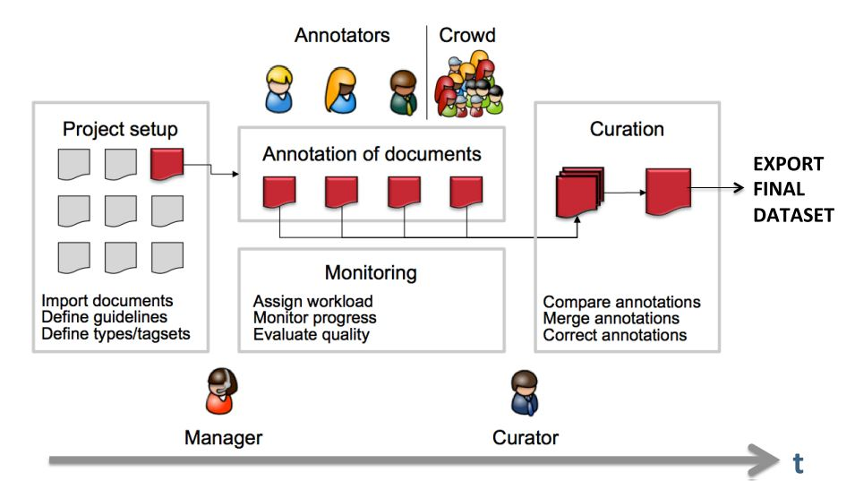

// Licensed to the Technische Universität Darmstadt under one
// or more contributor license agreements.  See the NOTICE file
// distributed with this work for additional information
// regarding copyright ownership.  The Technische Universität Darmstadt 
// licenses this file to you under the Apache License, Version 2.0 (the
// "License"); you may not use this file except in compliance
// with the License.
//  
// http://www.apache.org/licenses/LICENSE-2.0
// 
// Unless required by applicable law or agreed to in writing, software
// distributed under the License is distributed on an "AS IS" BASIS,
// WITHOUT WARRANTIES OR CONDITIONS OF ANY KIND, either express or implied.
// See the License for the specific language governing permissions and
// limitations under the License.
[sect_project_lifecycle]
= Project life cycle

The following image shows the typical life-cycle of an annotation project in {product-name}.

Initially, the **project manager** sets up the project.
This includes defining the annotation scheme and the annotation guidelines, uploading the documents, and adding annotators.
If the manager wants to delegate the task of quality control to another person, they can also add a curator.
The process of setting up and managing a project are further described in <<sect_projects>>.

Once the project has been set up, it is the time for the **annotators** to start their work.
They log in to the system and start annotating the documents according to the guidelines.
When an annotator is done with a document, they mark it as _Finished_ to indicate that it can be reviewed by the curator.

During the project **curator** (often the same person who is also the **project manager**) control the progress and quality of the project via the <<sect_workload>> and <<sect_agreement>> functionalities.
When a document has been fully annotated, the curator may review and adjudicate the annotations using the <<sect_curation>> functionality.
When the curator is has adjudicated a document, they also mark the document as _Finished_.

Once all documents have been fully adjudicated, the entire project is considered _Finished_.
The **project manager** then typically exports the annotations and documents for further processing.
