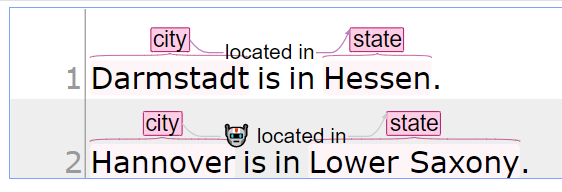

// Licensed to the Technische Universität Darmstadt under one
// or more contributor license agreements.  See the NOTICE file
// distributed with this work for additional information
// regarding copyright ownership.  The Technische Universität Darmstadt 
// licenses this file to you under the Apache License, Version 2.0 (the
// "License"); you may not use this file except in compliance
// with the License.
//  
// http://www.apache.org/licenses/LICENSE-2.0
// 
// Unless required by applicable law or agreed to in writing, software
// distributed under the License is distributed on an "AS IS" BASIS,
// WITHOUT WARRANTIES OR CONDITIONS OF ANY KIND, either express or implied.
// See the License for the specific language governing permissions and
// limitations under the License.

== 🧪 String Matcher for Relations

====
CAUTION: Experimental feature. To use this functionality, you need to enable it first by adding `recommender.string-matching.relation.enabled=true` to the `settings.properties` file (see the <<admin-guide.adoc#sect_settings, Admin Guide>>).
====

The string matching relation recommender can be used to predict relations, i.e. it predicts if there is a connection between
two annotations and what the relation's feature value might be. You need a base layer with a feature on it in addition
to a relation layer on top configured for it to work.

As an example, we define a base layer called `Locations`. We add a
String feature named `value` on it. Then, we define a relation layer on top of it called `Located`, with a String feature
named `relation`.

During configuration, we first need to select the feature of the relation that should be predicted.
We create a String matcher for relations, choose the relation layer to be `Located` and the base layer
feature as `value`. This recommender now saves tuples of `(source:value, target:value, relation)`. If it encounters a
sentence that contains locations with the same source and target value, it predicts a relation between them with the label
it saw before.

For instance, given the following text

[literal]
Darmstadt is in Hesse.
Hanover is in Lower Saxony.

we annotate _Darmstadt_ and _Hanover_ as a location with `value=city` and _Hesse_ and _Lower Saxony_ as a location with `value=state`. We draw a relation between _Darmstadt_ and _Hesse_ with a label of _located in_. The recommender then predicts that Hanover is also located in Lower Saxony, because it learned that a relation between `city` and `state` should have label `located in`.

This recommender currently does not work for base layers that allow stacking.

This recommender is not enabled by default, please refer to the admin guide for how to enable it.