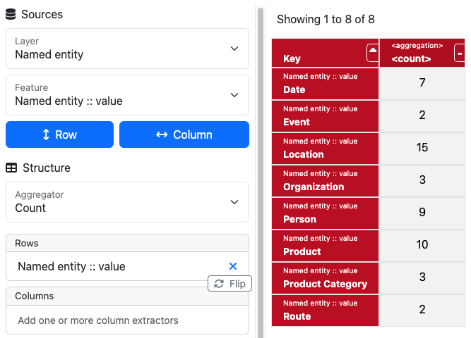
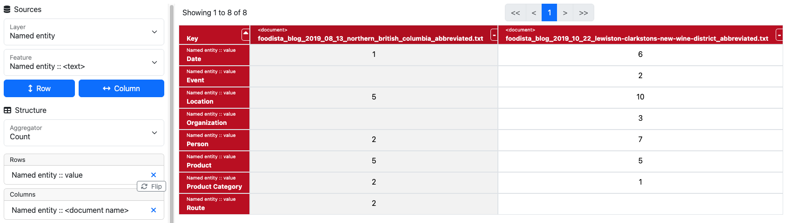
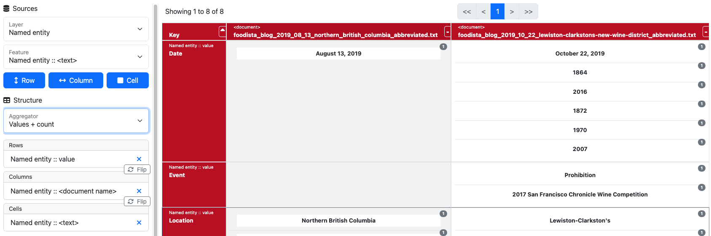

// Licensed to the Technische Universität Darmstadt under one
// or more contributor license agreements.  See the NOTICE file
// distributed with this work for additional information
// regarding copyright ownership.  The Technische Universität Darmstadt 
// licenses this file to you under the Apache License, Version 2.0 (the
// "License"); you may not use this file except in compliance
// with the License.
//  
// http://www.apache.org/licenses/LICENSE-2.0
// 
// Unless required by applicable law or agreed to in writing, software
// distributed under the License is distributed on an "AS IS" BASIS,
// WITHOUT WARRANTIES OR CONDITIONS OF ANY KIND, either express or implied.
// See the License for the specific language governing permissions and
// limitations under the License.

[[sect_explorer]]
= Explorer

The *Explorer* allows you to analyze and correlate the annotations in your project.
You do this by constructing a table, deciding which data should go into columns, rows, and cells.
You can also apply filters to restrict the data that is shown in the table, e.g., to consider only particular annotators or documents.

Let's first prepare a project with some example annotations to work with:

. Open the *New Project* dialog on the project overview page.
. Make sure the *Include Example Documents* switch is on.
. Then create a new project from the template *Entity Annotation*.

Now we are ready to explore the annotations in our new project:

. Start by selecting an item from the *Layer* dropdown, e.g., *Named Entity*.
. Then you select an item from the *Feature* dropdown, e.g., *Value*.
. Now you click on the *Row* or *Column* button to add the feature as a row or column dimension.
. Finally, you click on the *Run* button to generate the table.

Now you could add more dimensions.
For example, to see the distribution of entity types across documents, select the *Document Name* feature from the *Feature* dropdown and add it as a column dimension and press *Run* again.

You can add multiple features to the rows and columns.
The row and column keys will then be constructed by the different unique combinations of feature values.

By default, the cells of the table show the number of annotations that match the respective row and column keys.
Using the *Aggregator* dropdown, you can choose to fill the cells with other information.
For example, try selecting *Values + Count*. 
This will add a new *Cell* dimension to the table to which you can assign information.
Select the *Text* feature from the *Feature* dropdown and add it as a cell dimension.
Now press *Run* again to see that the cells in the table now show the text of the entity annotations in the table cells along with how often they occur.

Use the filters to limit the data used for the table to specific annotators or documents.
If no annotators or documents are selected, all annotators and documents are considered.
Note that documents that are locked for a given user are not considered for this user.
For pre-annotated documents on which annotators have not started working yet, the pre-annotations are considered as if they had been created by the respective annotator.

== Behind the Scenes

Now that you have an idea how to use the *Explorer*, let's delve into how it processes the data.
By adding rows and columns to the table, you determine which annotations are used to construct the table data.
For example, if you add any feature of the *Named Entity* layer to the rows or columns, then all 
annotations from this layer are considered—by default across all annotators and documents, unless
you apply filters.
If you add a feature of another layer to a row or column, then annotations from both layers are considered.
Even if you add multiple features from the same layer, all annotations from this layer are considered only once.

Typically, a feature belongs only to a single layer.
However, there are several features which can be used across layers, e.g., features such as *Document Name*, *Annotator*, or *Text*.
These are marked in the feature dropdown with pointy brackets, e.g., `<Text>`.
So let's say you add the `<Text>` feature of some layer *A* to the rows and the `<Text>` feature of another layer *B* as well, then the count for the cell of each row will be increased if either an annotation from layer *A* or from layer *B* has annotated the text indicated by the row key.
This allows you to correlate annotations from different layers based, for example, on the text they have annotated.

To split the count between the two layers, you can add the *Type* feature of both layers to the columns.
Alternatively, you can select the *General* category in the layer dropdown and select the *Text* feature from there to the columns.
If you select any feature from a specific layer, it will cause annotations of this layer to be considered when building the table. 
Choosing a feature from the *General* category will not cause any new annotations to be considered.
It will just extract the feature from the annotations that are already considered because of other features in the rows or columns.
Note that adding features to the cells never causes any new annotations to be considered.

