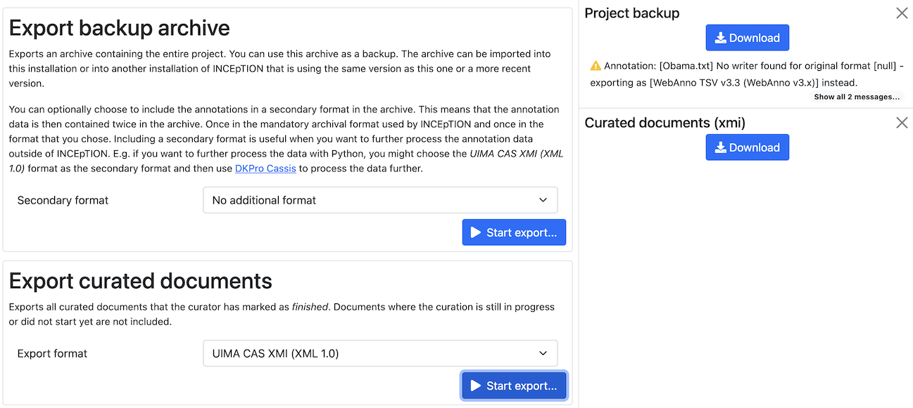

// Licensed to the Technische Universität Darmstadt under one
// or more contributor license agreements.  See the NOTICE file
// distributed with this work for additional information
// regarding copyright ownership.  The Technische Universität Darmstadt 
// licenses this file to you under the Apache License, Version 2.0 (the
// "License"); you may not use this file except in compliance
// with the License.
//  
// http://www.apache.org/licenses/LICENSE-2.0
// 
// Unless required by applicable law or agreed to in writing, software
// distributed under the License is distributed on an "AS IS" BASIS,
// WITHOUT WARRANTIES OR CONDITIONS OF ANY KIND, either express or implied.
// See the License for the specific language governing permissions and
// limitations under the License.

[[sect_projects_export]]
= Export

Here you can export the project for different purposes. Once an export process has been started, its progress can be see in the right sidebar.
If an export takes very long, you can keep it running and check back regularly to see its state. 
You can even log out and log in later.
Once the export is complete, you have 30 minutes to download it before it gets cleaned up automatically.
Any user with project manager permissions can visit this page and view the exports.
When a user cancels an export or downloads an export, it is removed from the list.
If there are any messages, warnings or errors, you should inspect them before cancelling or downloading the export.
While an export is running, only the latest messages is displayed and it can happen that messages are skipped.
Once the export is complete (either successfully or failed), the full list of messages is accessible.

== Export backup archive

This export is for the purpose of creating a backup, of migrating it to a new {product-name} version, of migrating to a different {product-name} instance, or simply in order to re-import it as a duplicate copy.   

The export is an archive which can be re-imported again since it includes the annotations in the format internally used by the application. 

In addition to the internal format, the annotations can optionally be included in a secondary format in the export.
Files in this secondary format are ignored if the archive is re-imported into {product-name}.
This format is controlled by the *Secondary Format* drop-down field. When *AUTO* is selected, the file format corresponds to the format of the source document.
If there is no write support for the source format, the file is exported in the WebAnno TSV3 format instead.
If the original file format did not contain any annotations (e.g. plain text files) or only specific types of annotations (e.g. CoNLL files), the secondary annotation files will also have none or limited annotations. 

NOTE: Some browsers automatically extract ZIP files into a folder after the download.
      Zipping this folder and trying to re-import it into the application will generally not work because the process introduces an additional folder level within the archive.
      The best option is to disable the automatic extraction in your browser.
      E.g. in Safari, go to *Preferences* -> *General* and disable the setting *Open "safe" files after downloading*.

When exporting a whole project, the structure of the exported ZIP file is as follows:

.Inner structure of a project archive
[source,text]
----
📂 <project ID>.json - project metadata file
📂 annotation
   └── 📂 <source document name>
       └── 📄 <user ID>.XXX - file representing the annotations for this user in the selected format
       └── 📄 project - automatically generated suggestions
📂 annotation_ser
   └── 📂 <source document name>
       └── 📄 <user ID>.ser - serialized CAS file representing the annotations for this user
       └── 📄 project - automatically generated suggestions
📂 curation
   └── 📂 <source document name>
       └── 📄 CURATION_USER.XXX - file representing the state of curation in the selected format
📂 curation_ser
   └── 📂 <source document name>
       └── 📄 CURATION_USER.ser - serialized UIMA CAS representing the state of curation
📂 log
   └── 📄 <project ID>.log - project log file
📂 source - folder containing the original source files
----

== Export curated documents

This export only includes only the curated documents for the purpose of getting an easy access to the final annotation results.
If you do not have any curated documents in your project, this export option is not offered.
A re-import of such archives is not possible.
