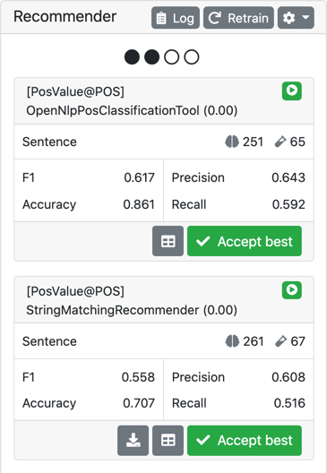

// Licensed to the Technische Universität Darmstadt under one
// or more contributor license agreements.  See the NOTICE file
// distributed with this work for additional information
// regarding copyright ownership.  The Technische Universität Darmstadt 
// licenses this file to you under the Apache License, Version 2.0 (the
// "License"); you may not use this file except in compliance
// with the License.
//  
// http://www.apache.org/licenses/LICENSE-2.0
// 
// Unless required by applicable law or agreed to in writing, software
// distributed under the License is distributed on an "AS IS" BASIS,
// WITHOUT WARRANTIES OR CONDITIONS OF ANY KIND, either express or implied.
// See the License for the specific language governing permissions and
// limitations under the License.

[[sect_annotation_recommendation]]
= Recommenders
After configuring one or more recommender in the <<sect_projects_recommendation, Project Settings>>, they can be used during annotation to generate predictions.
In the annotation view, predictions are shown as grey bubbles.
Predictions can be accepted by clicking once on them. In order to reject, use a double-click.
For an example how recommendations look in action, please see the screenshot below.

image::images/annotation_editor_with_suggestions.png[align="center"]

Suggestions generated by a specific recommender can be deleted by removing the corresponding recommender in the  <<sect_projects_recommendation, Project Settings>>. 
Clicking *Reset* in the _Workflow_ area will remove all predictions, however it will also remove all hand-made annotations.

== Accept/reject buttons

====
CAUTION: Experimental feature. To use this functionality, you need to enable it first by adding `recommender.action-buttons-enabled=true` to the `settings.properties` file (see the <<admin-guide.adoc#sect_settings, Admin Guide>>).
====

It is possible to enable explicit *Accept* and *Reject* buttons in the annotation interface.
These appear left and right of the suggestion marker as the mouse hovers over the marker.

== Recommender Sidebar

Clicking the chart icon in the left sidebar tray opens the recommendation sidebar which provides access to several functionalities:

View the state of the configured recommenders ::
  The icon in the top-right corner of the info box indicates the state of the recommender, e.g. if it is active, inactive, or if information on the recommender state is not yet available due to no self-evaluation or train/predict run having been completed yet.
View the self-evaluation results of the recommenders ::
  When evaluation results are available, the info box shows sizes of the training and evaluation data it uses for self-evaluation (for generating actual suggestions, the recommender is trained on all data), and the results of the self-evaluation in terms of F1 score, accuracy, precision and recall.
View the confusion matrix for a recommender ::
  When evaluation results are available, there is also the option to view the confusion matrix of the results. This is a square matrix showing all of the possible labels on each axis and indicating for each pair of labels how often during the self-evaluation run, one was mistaken for the other by the recommender.
View the training log of the recommenders ::
  The recommender log provides detailed information which recommenders did run or did not run on which layers. This can be useful if you believe that a recommender should be active but it is not. The log usually contains two sections. The first section contains the log messages for the currently visible suggestions. If a background training and prediction run has completed, there is also a second part contains the log messages for the suggestions that will become visible on the next user interaction.
Manually trigger a re-training of all recommenders ::
  You can manually clear and re-train all recommenders. This causes all suggestions to disappear immediately and a self-evaluation run followed by a training and prediction run is triggered. Once they have completed, the logs become available via the log button and the suggestions become available once the main editor is refreshed either via a user action (e.g. making an annotation) or e.g. by reloading the browser page.
Bulk-accept the best recommendations of a given recommender ::
  If you trust a recommender, you can bulk-accept its best annotations. In this case *best* means that if the recommender has generated multiple suggestions at the same location, the suggestion with the highest score is accepted.
Export the model of the recommender ::
  If a recommender supports exporting its trained model, then there is a button to download the model. Currently, only the String Matching Span Recommender supports this option. A Model exported
  from this recommender can be uploaded a gazetteer to a String Matching Span Recommender in the project settings. 

=== Evaluation scores and recommender activation
The circles at the top of the sidebar indicate the progress towards the next recommender evaluation.
Every change to the annotations triggers a new training and prediction run.
If a run is already in progress, at most one additional run is queued. When a run starts, it always use the latest annotation data available at the time.
Every 5th run, an additional evaluation step is triggered. This updates the recall, precision, accuracy and F1 scores in the sidebar.
Also, if a recommender has been configured to activate only at a particular score threshold, then the recommender may get activated or deactivated depending on the evaluation results.

=== Additional settings
Additionally, there are several configuration options available from the settings dropdown accessible via the cogwheel icon:

Configure the minimum score threshold for a suggestion to be visible ::
  Sets a minimum score for an individual suggestion to become visible. Any suggestions with a lower score are not shown. 
Configure how many suggestions are shown for a given position ::
  If there is more than one suggestion generated for a given position by all recommenders, then of all these suggestions only the n suggestions with the highest scores will be shown. Note though, that scores are not necessarily comparable between recommenders.
Configure whether to show hidden suggestions ::
  In some cases, you may wonder why a suggestion you expect to see does not appear. Then you can choose to show all hidden suggestions. Hovering the mouse over a previously hidden suggestion will  include information on why that suggestion was hidden. 
