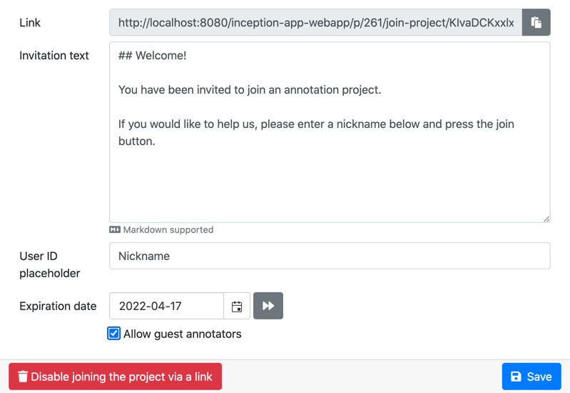

// Licensed to the Technische Universität Darmstadt under one
// or more contributor license agreements.  See the NOTICE file
// distributed with this work for additional information
// regarding copyright ownership.  The Technische Universität Darmstadt 
// licenses this file to you under the Apache License, Version 2.0 (the
// "License"); you may not use this file except in compliance
// with the License.
//  
// http://www.apache.org/licenses/LICENSE-2.0
// 
// Unless required by applicable law or agreed to in writing, software
// distributed under the License is distributed on an "AS IS" BASIS,
// WITHOUT WARRANTIES OR CONDITIONS OF ANY KIND, either express or implied.
// See the License for the specific language governing permissions and
// limitations under the License.

[[sect_projects_sharing]]
= 🧪 Invite Links

====
CAUTION: Experimental feature. To use this functionality, you need to enable it first by adding `sharing.invites.enabled=true` to the `settings.properties` file (see the <<admin-guide.adoc#sect_settings, Admin Guide>>).
====

Project managers can generate invite links to their projects which allow users to easily join their project.
For this, visit the *Project Settings* and click on *Share Project*.
Clicking on *Allow joining the project via a link* will generate the invite link that can then be copied and given to users (e.g. via email).

The user can now follow the invite link by entering it into a browser.
She might be prompted to log into {product-name} and is then automatically added to the project with annotator role and directed to the project dashboard page.
She can now start annotating.

== Invite life time

The life time of an invite link can be controlled in several ways:

* *By date:* you can set an expiration date indicating a date until which the annotation will be valid.
* *By annotator count:* you can set a limit of annotators for project. If the number of users in the
  project reaches this number, the invite link can no longer be used to join.
* *By project state:* the invite can be configured to stop working once all documents in the document
  have been annotated. What exactly _all documents have been annotated_ means depends on the workload
  management strategy that has been configured. E.g. for a project using the dynamic workload 
  management, the annotations of the project are considered to complete once the required number
  of annotators per document have marked all their documents as finished.
  
If any of the configured conditions are triggered, an alert is shown next do the condition and the invite link cannot be used anymore.

== Guest annotators

====
CAUTION: Experimental feature. To use this functionality, you need to enable it first by adding `sharing.invites.guests-enabled=true` to the `settings.properties` file (see the <<admin-guide.adoc#sect_settings, Admin Guide>>).
====

By default, users need to already have a {product-name} account to be able to use the link. However,
by activating the option *Allow guest annotators*, a person accessing the invite link can simply
enter any user ID they like and access the project using that ID. This ID is then valid only via the
invite link and only for the particular project. The ID is not protected by a password. When the
manager removes the project, the internal accounts backing the ID are automatically removed as well.

It is possible to replace the user ID input field placeholder with a different text. This is useful
if you e.g. want your users to user a specific information as their user ID. E.g. if you use this
feature in a classroom scenario, you might find it convenient if the students provide their
matriculation number.

NOTE: Make sure to avoid multiple users signing in with the same user ID - {product-name} does not
support being used from multiple browsers / windows / computers concurrently with the same user ID!

Optionally the invite can be configured to require guest annotators to enter an email address in
addition to the user ID. If a user provides an email address along with the user ID, then for
subsequent logins, the user needs to provide the same email address. If a different email address
is provided, then the login is rejected.

NOTE: When importing a project with guest annotators, the annotations of the guests can only be 
imported if the respective guest accounts do not yet exist in the {product-name} instance. This
means, it is possible to make a backup of a project and to import it into another {product-name} 
instance or also into the original instance after deleting the original project. However, when 
importing a project as a clone of an existing project in the same instance, the imported project
will not have any guest annotators.

