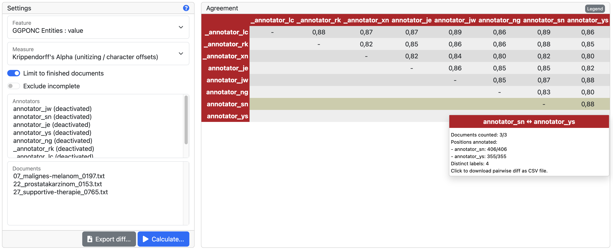

// Licensed to the Technische Universität Darmstadt under one
// or more contributor license agreements.  See the NOTICE file
// distributed with this work for additional information
// regarding copyright ownership.  The Technische Universität Darmstadt 
// licenses this file to you under the Apache License, Version 2.0 (the
// "License"); you may not use this file except in compliance
// with the License.
//  
// http://www.apache.org/licenses/LICENSE-2.0
// 
// Unless required by applicable law or agreed to in writing, software
// distributed under the License is distributed on an "AS IS" BASIS,
// WITHOUT WARRANTIES OR CONDITIONS OF ANY KIND, either express or implied.
// See the License for the specific language governing permissions and
// limitations under the License.

[[sect_agreement]]
= Agreement

NOTE: This functionality is only available to *curators* and *managers*. 
Agreement can only be calculated for span and relation layers. 
The set of available agreement measures depends on the layer configuration.

[.i7n-assistant]
--
The agreement calculation functionality allows curators and managers to measure the consistency of annotations made by different users. 
It computes inter-annotator agreement for span and relation layers on a per-feature basis, providing pair-wise agreement scores across all documents. 
This process assists in assessing the reliability and accuracy of the annotations. 

To use the agreement calculation functionality, you need to select a *Feature* and a *Measure*. 

The *Feature* specifies which layer and feature are used for the agreement calculation. 

The *Measure* specifies which agreement measure is used for the calculation. 
A default measure is selected based on the feature. 
Depending on the feature settings, only certain measures may be available. 
A short description of available measures and their differences is provided in the <<sect_agreement_measures, Measures>> section. 

NOTE: For some layers or features, there may not be any measures available. 
      You may still be able to export the labels using the *CSV* and/or *JSON* options from the *Export...* dropdown. 

Optionally, you can limit the process to specific *annotators* or *documents*. 
If you do not make any selection here, all annotators and documents are considered. 
If you select annotators, at least two annotators must be selected. 
To select multiple annotators or documents, hold, for example, the kbd:[Shift] or kbd:[CTRL]/kbd:[CMD] keys while clicking, depending on your browser and operating system. 
The option *include original* is useful if you have imported pre-annotated documents as it can be used to compare annotators against the original pre-annotated.
The option *include curator* is useful if you want to compare the annotator's performance (or even the original) to the final curated version.

The *Pairwise...* button can be used to start the agreement calculation, and the results will be shown in a <<sect_agreement_matrix,Pairwise agreement matrix>>. 

The *Per document...* button can be used to start the agreement calculation, and the results will be shown in a per-document table. 

NOTE: The calculation may take some time to complete. 
      You can monitor the progress of the calculation by clicking on the background tasks indicator in the page footer. 

The *Export...* menu provides access to several export options: 
* The *CSV* format exports the labels for all selected annotators and documents in a tabular format, where each row represents a position and label. 
  If there are multiple labels from an annotator or multiple annotators for a position, these are rendered as separate rows. 
* The *JSON* format exports the labels for all selected annotators and documents in a JSON format. 
* The *Diagnosis* format exports the labels for all selected annotators and documents in a tabular format where each labelled position is a row and there is one column for each annotator. 
  This format includes the flags calculated by the agreement preprocessing step, such as whether the position is complete or incomplete, and whether it has been used during agreement calculation. 
  It is useful for diagnosing the agreement calculation and understanding the data. 
--

[[sect_agreement_measures]]
== Measures

Several agreement measures are supported.

.Supported agreement measures
|====
| Measure | Type | Short description

| Cohen's kappa
| Coding
| Chance-corrected inter-annotator agreement for two annotators.
The measure assumes a different probability distribution for all raters.
Incomplete annotations are always excluded.

| Fleiss' kappa
| Coding
| Generalization of Scott's pi-measure for calculating a chance-corrected inter-rater agreement for multiple raters, which is known as Fleiss' kappa and Carletta's K.
The measure assumes the same probability distribution for all raters.
Incomplete annotations are always excluded.

| Krippendorff's alpha (nominal)
| Coding
| Chance-corrected inter-rater agreement for multiple raters for nominal categories (i.e. categories are either equal (distance 0) or unequal (distance 1).
The basic idea is to divide the estimated variance of within the items by the estimated total variance.

| Krippendorff's alpha (unitizing)
| Unitizing
| Chance-corrected inter-rater agreement for unitizing studies with multiple raters.
As a model for expected disagreement, all possible unitizations for the given continuum and raters are considered.
Note that units coded with the same categories by a single annotator may not overlap with each other.
If such units are detected, the system will pass the unit starting earliest and being longest to the agreement and will skip all of the other overlapping units. 
|====

== Coding vs. Unitizing

Before diving into advanced agreement measures, it is helpful to understand two key concepts: *coding* and *unitizing*.

*Coding* means comparing annotations at specific, fixed positions in the text—like checking if two annotators labeled the same word or phrase.
This is straightforward when everyone agrees on the exact boundaries of what to annotate.

*Unitizing* is used when annotators can mark spans of text that may start and end at different places, or even overlap.
This is common in tasks like named entity recognition, where people might disagree on the exact boundaries of an entity.
Unitizing measures are designed to handle these cases, allowing for partial matches and overlaps between annotations.

.Coding measures
Coding measures (e.g. Cohen's kappa) are based on positions. 
Two annotations are either at the same position or not. 
If they are, they can be compared; otherwise, they cannot be compared. 
This characteristic makes coding measures unsuitable in cases where partial overlap of annotations must be considered, such as in named entity annotation, where annotators may not agree on the boundaries of the entity. 

To calculate the positions, all documents are scanned for annotations, and annotations located at the same positions are collected into configuration sets. 
A configuration set is a group of annotations that are considered to refer to the same position, based on the layer type. 
For a span layer, the begin and end offsets are used. 
For a relation layer, the begin and end offsets of the source and target annotation are used. 
For a document metadata layer, the document is used.
Chains are currently not supported. 

.Unitizing measures
Unitizing measures can deal with cases where the positions of annotations overlap or are not exactly the same. 
This is especially useful in real-world annotation tasks, where people may interpret boundaries differently or highlight slightly different parts of the text.

For example, imagine two annotators are asked to highlight the phrase referring to a specific object. One might select *the blackboard* while another selects just *blackboard*. 
Although their selections are not identical, they share a substantial portion of text. In such cases, unitizing measures do not simply mark this as disagreement—instead, they recognize the *partial overlap* and give partial credit for the shared part.
Partial overlap agreement is calculated based the character overlap, not on the token overlap.
That means, if one annotator annotates *the blackboard* and another annotator annotates only *blackboard*, the partial overlap is comparatively high because *blackboard* is a substantial portion of the span, even though an entire word is missing from the first annotator's span.
Relation and chain layers are presently not supported by the unitizing measures.
For document metadata layers, partial overlap is not applicable, as the entire document is considered as a single position.

== Incomplete annotations

When using coding measures, there is the concept of *incomplete annotations*. 
An annotation is incomplete if at least one annotator has not provided a label for a given position. 
In pairwise comparisons, this means one annotator has made a label and the other has not. 

Positions are matched based on the spans or relation endpoints chosen by annotators. 
If one annotator labels *the blackboard* and another labels only *blackboard*, these are treated as two separate positions. 
Both are considered incomplete because not all annotators labeled the same span. 

Some agreement measures cannot handle incomplete annotations. 
These measures require every annotator to provide a label for each position. 
If a measure cannot handle incomplete annotations, those positions are *excluded* from the calculation. 
Note that this exclusion may lead to misleading results. 
For example, results may appear overly positive because potential disagreements were not considered. 
If the annotators disagreed on the *blackboard*/*the blackboard* position but then agree with position and label on *chalk* later in the same document, the agreement score will be perfect because it is based only on the *chalk* position. 

This can affect the agreement score. 
For example, if annotators only agree on one word, only that word is counted. 
The agreement score may appear perfect even if they disagreed elsewhere. 

Measures like Fleiss' kappa and Cohen's kappa cannot handle incomplete annotations. 
They should only be used when all annotators are required to label every position, such as in part-of-speech tagging. 

It is recommended to use a measure that supports incomplete data (missing labels), or a unitizing measure that can provide partial agreement scores. 

.Distinction between "no annotation", "empty", and "null"
* *No annotation*: The annotator did not create an annotation at the given position.
  This means there is no annotation object at all for that position.
* *Empty*: The annotator created an annotation, but the feature value is an empty string (`""`).
  This is a valid label and is included in the agreement calculation.
* *Null*: The annotator created an annotation, but the feature value is `null`.
  This is treated the same as an empty string in the agreement calculation.

For example:
- If annotator 1 does not annotate a position and annotator 2 assigns the label `bar`, this is considered "no annotation" vs. a label.
- If annotator 1 assigns an empty string and annotator 2 assigns `bar`, this is "empty" vs. a label.
- If annotator 1 assigns `null` and annotator 2 assigns an empty string, this is "null" vs. "empty" and is treated as agreement.

.Possible combinations for agreement
|====
| Feature value annotator 1 | Feature value annotator 2 | Agreement | Complete

| `foo`
| `foo`
| yes
| yes

| `foo`
| `bar`
| no
| yes

| *no annotation*
| `bar`
| no
| no

| *empty*
| `bar`
| no
| yes

| *empty*
| *empty*
| yes
| yes

| *null*
| *empty*
| yes
| yes

| *empty*
| *no annotation*
| no
| no

|====

== Stacked annotations

Multiple interpretations in the form of stacked annotations are not supported in the agreement calculation. 
This also includes relations for which source or target spans are stacked.

[[sect_agreement_matrix]]
== Pairwise agreement matrix

To calculate the pairwise agreement, the measure is applied pairs of documents, each document containing annotations from one annotator.
If an annotator has not yet annotated a document, the original state of the document after the import is considered.
To calculate the overall agreement between two annotators over all documents, the average of the per-document agreements is used. 

The lower part of the agreement matrix displays how many configuration sets were used to calculate agreement and how many were found in total. 
The upper part of the agreement matrix displays the pairwise agreement scores.

Annotations for a given position are considered complete when both annotators have made an annotation. 
Unless the agreement measure supports `null` values (i.e. missing annotations), incomplete annotations are implicitly excluded from the agreement calculation.
If the agreement measure does support incomplete annotations, then excluding them or not is the users' choice.
