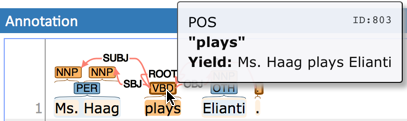

////
// Licensed to the Technische Universität Darmstadt under one
// or more contributor license agreements.  See the NOTICE file
// distributed with this work for additional information
// regarding copyright ownership.  The Technische Universität Darmstadt 
// licenses this file to you under the Apache License, Version 2.0 (the
// "License"); you may not use this file except in compliance
// with the License.
//  
// http://www.apache.org/licenses/LICENSE-2.0
// 
// Unless required by applicable law or agreed to in writing, software
// distributed under the License is distributed on an "AS IS" BASIS,
// WITHOUT WARRANTIES OR CONDITIONS OF ANY KIND, either express or implied.
// See the License for the specific language governing permissions and
// limitations under the License.
////

= Relations

In order to create relation annotation, a corresponding relation layer needs to be defined
and attached to the span layer you want to connect the relations to. An example of a relation
layer is the built-in **Dependency** relation layer which connects to the **Part of speech**
span layer, so you can create relations immediately on the **Part of speech** layer to try it out.

If you want to create relations on other span layers, you need to create a new layer of type 
**Relation** in the  <<sect_projects_layers,layer settings>>. Attach the new relation layer
to a span layer. Note that only a single relation layer can connect to any given span layer.

Then you can start connecting the source and target annotations using relations. 

There are two ways of creating a relation:

* for short-distance relations, you can conveniently create relation by left-clicking on a span and
  while keeping the mouse button pressed moving the cursor over to the target span. A rubber-band
  arc is shown during this drag-and-drop operation to indicate the location of the relation.
  To abort the creation of an annotation, hold the *CTRL* key when you release the mouse button.
  
* for long-distance relations, first select the source span annotation. Then locate the target 
  annotation. You can scroll around or even switch to another page of the same document - just
  make sure that your source span stays selected in the annotation detail editor panel on the right.
  Once you have located the target span, right-click on it and select **Link to...**. Mind that
  long-ranging relations may not be visible as arcs unless both the source and target spans are
  simultaneously visible (i.e. on the same "page" of the document). So you may have to increase the
  number of visible rows in the settings dialog to make them visible.

.Navigating along relations
When a relation annotation is selected, the annotation detail panel includes two fields **From** and
**To** which indicate the origin and target annotations of the relation. These fields include a small
cross-hair icon which can be used to jump to the respective annotations.

When a span annotation is selected, and incoming or outgoing relations are also shown in the
annotation detail panel. Here, the cross-hair icon can be used to jump to the other endpoint of the
relation (i.e. to the other span annotation). There is also an icon indicating whether the relation
is incoming to the selected span annotation or whether it is outgoing from the current span.
Clicking on this icon will select the relation annotation itself.

Depending on the layer behavior configuration, relation annotations can stack, can cross each other,
and can cross sentence boundaries.

.Self-looping relations
To create a relation from a span to itself, press the kbd:[Shift] key before starting to drag the mouse
and hold it until you release the mouse button. Or alternatively select the span and then 
right-click on it and select **Link to...**.

NOTE: Currently, there can be at most one relation layer per span layer. Relations between spans
      of different layers are not supported.

NOTE: Not all arcs displayed in the annotation view are belonging to chain or relation layers. Some
      are induced by <<sect_annotation_link_features>>.

When moving the mouse over an annotation with outgoing relations, the info pop-up includes the
*yield* of the relations. This is the text transitively covered by the outgoing relations. This
is useful e.g. in order to see all text governed the head of a particular dependency relation.
The text may be abbreviated.

.Example of the yield of a dependency relation

