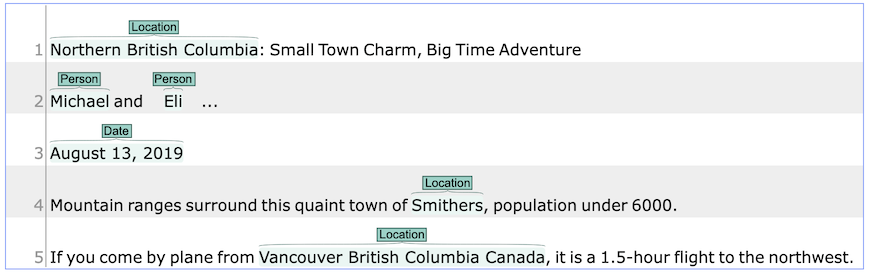
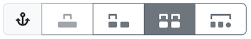

////
// Licensed to the Technische Universität Darmstadt under one
// or more contributor license agreements.  See the NOTICE file
// distributed with this work for additional information
// regarding copyright ownership.  The Technische Universität Darmstadt 
// licenses this file to you under the Apache License, Version 2.0 (the
// "License"); you may not use this file except in compliance
// with the License.
//  
// http://www.apache.org/licenses/LICENSE-2.0
// 
// Unless required by applicable law or agreed to in writing, software
// distributed under the License is distributed on an "AS IS" BASIS,
// WITHOUT WARRANTIES OR CONDITIONS OF ANY KIND, either express or implied.
// See the License for the specific language governing permissions and
// limitations under the License.
////

= Spans

To create an annotation over a span of text, click with the mouse on the text and drag the mouse to create a selection. When you release the mouse, the selected span is activated and highlighted in orange. The annotation detail editor is updated to display the text you have currently selected and to offer a choice on which layer the annotation is to be created. As soon as a layer has been selected, it is automatically assigned to the selected span. To delete an annotation, select a span and click on *Delete*. To deactivate a selected span, click on *Clear*.

Depending on the layer behavior configuration, span annotations can have any length, can overlap,
can stack, can nest, and can cross sentence boundaries. 

== Granularity

In the upper part of the right sidebar in the annotation page, you can find the quick-access buttons for the annotation granularity.

You can choose between four different levels of granularity for selecting text spans to annotate:  

* characters - annotations can start and end at any character position
* individual tokens - annotations only cover exactly one token
* token sequences - annotations can cover sequences of whole tokens
* sentence sequences - annotations can cover sequences of whole sentences

E.g. if you select *token sequences*, the annotations you create will always snap to token boundaries.
Note that the project manager can restrict the available granularity levels for a project in the project settings.  

.Granularity key bindings
|====
| Key | Action 

| kbd:[Shift + 1]
| characters

| kbd:[Shift + 2]
| individual tokens

| kbd:[Shift + 3]
| tokens sequences

| kbd:[Shift + 4]
| sentence sequences
|====

== Zero-width spans

To create a zero-length annotation, hold kbd:[Shift] and click on the position where you wish to create the annotation. To avoid accidental creations of zero-length annotations, a simple single-click triggers no action by default. The *lock to token* behavior cancels the ability to create zero-length annotations.

NOTE: A zero-width span between two tokens that are directly adjacent, e.g. the full stop at the
      end of a sentence and the token before it (`end.`) is always considered to be *at the end of the
      first token* rather than at the beginning of the next token. So an annotation between `d` and `.`
      in this example would be rendered at the right side of `end` rather than at the left side of `.`. 

link:http://en.wikipedia.org/wiki/Coreference[Co-reference] annotation can be made over several tokens within one sentence. A single token sequence can have several co-ref spans simultaneously.
