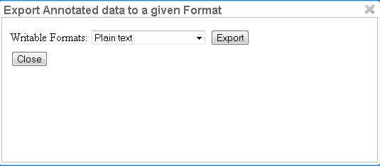

////
// Licensed to the Technische Universität Darmstadt under one
// or more contributor license agreements.  See the NOTICE file
// distributed with this work for additional information
// regarding copyright ownership.  The Technische Universität Darmstadt 
// licenses this file to you under the Apache License, Version 2.0 (the
// "License"); you may not use this file except in compliance
// with the License.
//  
// http://www.apache.org/licenses/LICENSE-2.0
// 
// Unless required by applicable law or agreed to in writing, software
// distributed under the License is distributed on an "AS IS" BASIS,
// WITHOUT WARRANTIES OR CONDITIONS OF ANY KIND, either express or implied.
// See the License for the specific language governing permissions and
// limitations under the License.
////

= Export

Annotations are always immediately persisted in the backend database.
Thus, it is not necessary to save the annotations explicitly.
Also, losing the connection through network issues or timeouts does not cause data loss.
To obtain a local copy of the current document, click on the *Export* button.
The following dialog will appear:

Choose your preferred format.
Please take note of the facts that the plain text format does not contain any annotations and that the files in the binary format need to be unpacked before further usage.
For further information the supported formats, please consult the corresponding chapter <<sect_formats>>.

The document will be saved to your local disk, and can be re-imported via adding the document to a project by a project manager.
Please export your data periodically, at least when finishing a document or not continuing annotations for an extended period of time. 
