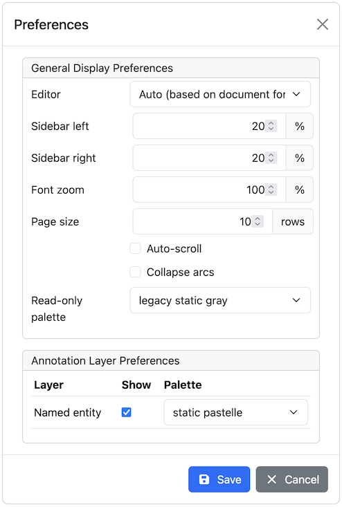

// Licensed to the Technische Universität Darmstadt under one
// or more contributor license agreements.  See the NOTICE file
// distributed with this work for additional information
// regarding copyright ownership.  The Technische Universität Darmstadt 
// licenses this file to you under the Apache License, Version 2.0 (the
// "License"); you may not use this file except in compliance
// with the License.
//  
// http://www.apache.org/licenses/LICENSE-2.0
// 
// Unless required by applicable law or agreed to in writing, software
// distributed under the License is distributed on an "AS IS" BASIS,
// WITHOUT WARRANTIES OR CONDITIONS OF ANY KIND, either express or implied.
// See the License for the specific language governing permissions and
// limitations under the License.

= Settings

Once the document is opened, a default of 5 sentences is loaded on the annotation page.
The *Settings* button will  allow  you  to specify the settings of the annotation layer.

The *Editor* setting can be used to switch between different modes of presentation.
It is currently only available on the annotation page.

The *Sidebar size* controls the width of the sidebar containing the annotation detail editor and 
actions box. In particular on small screens, increasing this can be useful.
The sidebar can be configured to take between 10% and 50% of the screen.

The *Font zoom* setting controls the font size in the annotation area.
This setting may not apply to all editors.

The *Page size* controls how many sentences are visible in the annotation area.
The more sentences are visible, the slower the user interface will react.
This setting may not apply to all editors.

The *Auto-scroll* setting controls if the annotation view is centered on the sentence in which the
last annotation was made.
This can be useful to avoid manual navigation.
This setting may not apply to all editors.

The *Collapse arcs* setting controls whether long ranging relations can be collapsed to save space
on screen. This setting may not apply to all editors.

The *Read-only palette* controls the coloring of annotations on read-only layers.
This setting overrides any per-layer preferences.

== Layer preferences

In this section you can select which annotation layers are displayed during annotation and how
they are displayed.

Hiding layers is useful to reduce clutter if there are many annotation layers.
Mind that hiding a layer which has relations attached to it will also hide the respective relations.
E.g. if you disable POS, then no dependency relations will be visible anymore.

The *Palette* setting for each layer controls how the layer is colored.
There are the following options:

* *static / static pastelle* - all annotations receive the same color
* *dynamic / dynamic pastelle* - all annotations with the same label receive the same color. Note
  that this does not imply that annotations with different labels receive different colors. 
* *static grey* - all annotations are grey.

Mind that there is a limited number of colors such that eventually colors will be reused.
Annotations on chain layers always receive one color per chain.
