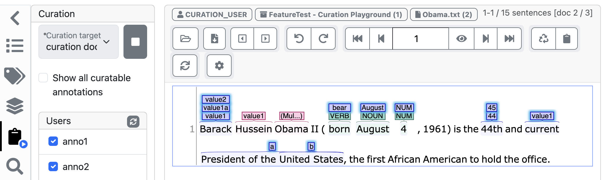

// Licensed to the Technische Universität Darmstadt under one
// or more contributor license agreements.  See the NOTICE file
// distributed with this work for additional information
// regarding copyright ownership.  The Technische Universität Darmstadt 
// licenses this file to you under the Apache License, Version 2.0 (the
// "License"); you may not use this file except in compliance
// with the License.
//  
// http://www.apache.org/licenses/LICENSE-2.0
// 
// Unless required by applicable law or agreed to in writing, software
// distributed under the License is distributed on an "AS IS" BASIS,
// WITHOUT WARRANTIES OR CONDITIONS OF ANY KIND, either express or implied.
// See the License for the specific language governing permissions and
// limitations under the License.

= 🧪 Curation Sidebar

====
CAUTION: Experimental feature. To use this functionality, you need to enable it first by adding `curation.sidebar.enabled=true` to the `settings.properties` file (see the <<admin-guide.adoc#sect_settings, Admin Guide>>).
====

Curation i.e. the process of combining finished annotated documents into a final curated document,
can be done via the *Curation Page* in INCEpTION (see <<sect_curation, Curation>>) but also via the
*Curation Sidebar* on the *Annotation Page*.

To start a curation session, you need to choose a **curation target** and press the **start curation
session** buttion next to the curation target select box.

* **curation document**: this is also used as the target when curating on the curation page. If
  you choose this target, you will notice that the username in the info line above the annotation
  document changes to `CURATION_USER` while the curation session is in progress.
* **my document**: this option is available if the curator is also an annotator in the project. In
  this case, the annotators own document may be chosen as the curation target.

Once the session has started, annotations from annotators that have marked the document as
**finished** will be visible. You can see a list of these annotators in the sidebar. If you want to
see only annotations from specific annotators, you can enabled/disabled them as you like.

The user can copy annotations *manually* from other users into the curation document by clicking on
them. The *automatic* merge can be triggered by clicking the *Re-Merge* button (sync icon). It will
copy all annotations that  all selected users agree on into the curation document.

Depending on the layer settings, once an annotation has been merged or an annotation has been
manually created in the curation target document, annotations from annotators might be hidden. This
happens for example when at a given position in the curation target document an annotation exists
and stacking is not enabled on the respective annotation layer. If you want to temporarily see all
annotations from the selected annotators, use the **Show all curatable annotations** checkbox.

The curation session remains active for a given project, even if you leave the annotation page and
come back at a later time. 

To stop a curation session, use the **stop curation session** button next to the curation target
select box.

It is possible to start/stop a curation session via the URL. Adding the URL query parameter 
`curationSession=on` to an annotation page URL will start a curation session (if none is running)
while `curationSession=off` will stop a running session. By default, the session is started using
the curation document as the curation target. By setting the parameter `curationTargetOwn=true`, the
curation target can be changed to the current users own document - if the user has the *annotator*
role in addition to the *curator* role. This parameter only takes effect when `curationSession=on` is
also set. Mind that curation sessions in a project run until terminated. If you want directly link
to a document on the annotation page and ensure that *no* curations session is running, be sure to
add the `curationSession=off` parameter.
Example: `http://localhost:8080/p/PROJECT/annotate/DOC-ID?curationSession=on&curationTargetOwn=true`.
