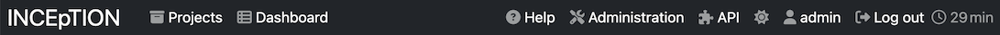

// Licensed to the Technische Universität Darmstadt under one
// or more contributor license agreements.  See the NOTICE file
// distributed with this work for additional information
// regarding copyright ownership.  The Technische Universität Darmstadt 
// licenses this file to you under the Apache License, Version 2.0 (the
// "License"); you may not use this file except in compliance
// with the License.
//  
// http://www.apache.org/licenses/LICENSE-2.0
// 
// Unless required by applicable law or agreed to in writing, software
// distributed under the License is distributed on an "AS IS" BASIS,
// WITHOUT WARRANTIES OR CONDITIONS OF ANY KIND, either express or implied.
// See the License for the specific language governing permissions and
// limitations under the License.

[[sect_menubar]]
= Menu bar

At the top of the screen, there is always a menu bar visible which allows a quick navigation within
the application. It offers the following items:

  * **Projects** - always takes you back to the <<user-guide.adoc#sect_projects_list,Project overview>>.
  * **Dashboard** - is only visible if it is possible to take you to your last visited <<user-guide.adoc#sect_project_dashboard,Project dashboard>>.
  * **Help** - opens the integrated help system in a new browser window.
  * **Administration** - takes you to the administrator dashboard which allows configuring projects
    or managing users. This item is only available to administrators.
  * **Username** - shows the name of the user currently logged in. If the administrator has allowed
    it, this is a link which allows accessing the current user's profile, e.g. to change the 
    password.
  * **Log out** - logs out of the application. 
  * **Timer** - shows the remaining time until the current session times out. When this happens, 
    the browser is automatically redirected to the login page.
    
