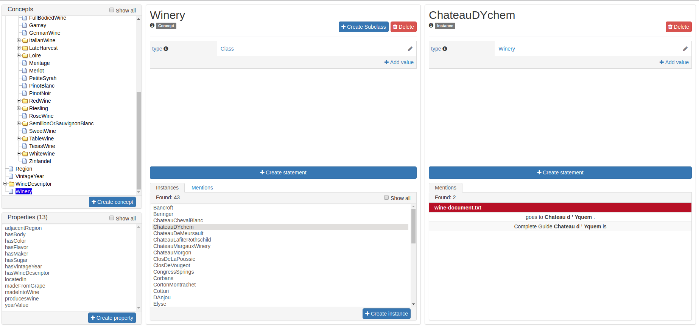

// Licensed to the Technische Universität Darmstadt under one
// or more contributor license agreements.  See the NOTICE file
// distributed with this work for additional information
// regarding copyright ownership.  The Technische Universität Darmstadt 
// licenses this file to you under the Apache License, Version 2.0 (the
// "License"); you may not use this file except in compliance
// with the License.
//  
// http://www.apache.org/licenses/LICENSE-2.0
// 
// Unless required by applicable law or agreed to in writing, software
// distributed under the License is distributed on an "AS IS" BASIS,
// WITHOUT WARRANTIES OR CONDITIONS OF ANY KIND, either express or implied.
// See the License for the specific language governing permissions and
// limitations under the License.
[[sect_knowledge_base]]
== Knowledge Base 

The knowledge base (KB) module of INCEpTION enables users to create a KB from scratch or import it from an RDF file.
Alternatively, users can connect to a remote KB using SPARQL. 
However, editing the content of remote KBs is currently not supported.
The knowledge base can then be used, for instance, for entity linking.

This section briefly describes how to set up a KB in the KB management page under *Project Settings*, explains the functionalities provided by the *Knowledge Base* page, and covers the *concept* and *property* feature types.

NOTE: For a knowledge base to be searchable (e.g., from the Knowledge Base page),  the configured knowledge base must have labels for all items (e.g., concepts, instances, properties) that should be found.

=== Knowledge Base Page

The knowledge base page provides:

- A concept tree hierarchy
- A list of instances and statements
- A list of properties (see figure below)

For local knowledge bases, users can edit the KB contents here, including adding, editing, and deleting concepts, properties, statements, and instances.

The *Mentions* panel connects the knowledge base page with the annotated text, showing specific mentions of concepts and instances annotated in the text.

[.thumb]

The concept tree is organized using the *subClass* relationship as configured.
Each concept can have a list of instances, shown in the *Instance* panel when a concept is selected.
The *Mentions* of the concept in the annotated text are also displayed.
Clicking on a specific instance shows the panel for the list of statements associated with the instance, along with its *Mentions* in the annotated text.
The lower left side of the page lists the set of properties from the knowledge base.
Clicking on a property displays the statements associated with it, such as labels, domains, ranges, etc.

If the user has the privilege to edit the knowledge base, they may add statements for concepts, instances, and properties.

=== Statement Editors

INCEpTION allows users to edit local knowledge bases, including adding statements or subclassing concepts and their instances.

To create a statement for a particular knowledge base entity, use the *Create Statement* option.

When creating a new statement about an instance:
- A list of available properties is shown.
- After selecting a property, specify the object of the statement.
- The possible properties for a given subject are restricted by the domain of the property (e.g., the property *born_in* would require an instance of *human* as the subject).

The same applies to the object of a statement: after choosing the property for a concept, the object must be specified.
The possible objects are limited by the range of the property, if given. Four different editors are available to specify features:

1. *Boolean*: Allows either *true* or *false*.
2. *Numeric*: Accepts integers or decimals.
3. *String*: Accepts a string with a language tag or a URI identifying a resource not in the knowledge base.
4. *KB Resource*: Provided as an option when the property has a range as a particular concept from the knowledge base. 
   This option offers an auto-complete field with a list of knowledge base entities, including subclasses and instances of the specified range.

[[sect_concept_features]]
=== Concept Features

Concept features allow referencing concepts in the knowledge base during annotation.

To create a new concept feature:
- Create a new feature under *Project Settings* -> *Layers*.
- Set the type of the new feature to *KB: Concept/Instance/Property*.
- Features of this type can be configured to accept only concepts, only instances, only properties, or any of these (select *any*).

[.thumb]
image::images/kb5.png[align="center"]

When creating a new annotation with this feature, the user is offered a dropdown with possible entities from the knowledge base.
This dropdown can be limited to only concepts, only features, or both, depending on the selected filter in the feature configuration.

The *scope* setting allows limiting linking candidates to a subtree of the knowledge base.

NOTE: Selecting a scope means that full-text search cannot be used.
      Queries may become very slow if the scope covers a large number of concepts or instances.
      Therefore, it is best not to choose too broad scopes.
