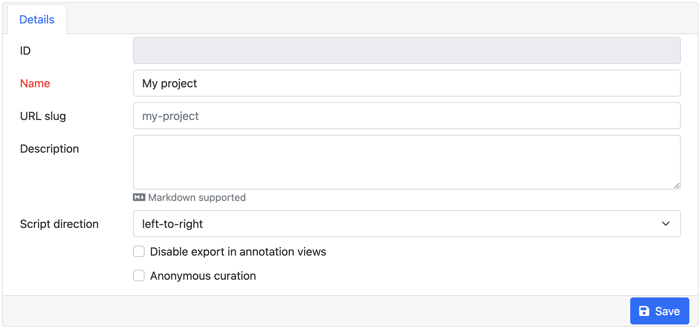

// Licensed to the Technische Universität Darmstadt under one
// or more contributor license agreements.  See the NOTICE file
// distributed with this work for additional information
// regarding copyright ownership.  The Technische Universität Darmstadt 
// licenses this file to you under the Apache License, Version 2.0 (the
// "License"); you may not use this file except in compliance
// with the License.
//  
// http://www.apache.org/licenses/LICENSE-2.0
// 
// Unless required by applicable law or agreed to in writing, software
// distributed under the License is distributed on an "AS IS" BASIS,
// WITHOUT WARRANTIES OR CONDITIONS OF ANY KIND, either express or implied.
// See the License for the specific language governing permissions and
// limitations under the License.

[[sect_projects]]
= Projects

NOTE: This functionality is only available to *managers* of existing projects, 
      *project creators* (users with the ability to create new projects), and *administrators*.
      Project managers only see projects in which they hold the respective roles. Project creators
      only see projects in which they hold the project manager role.

This is the place to define/edit annotation projects.  
You can either select one of the existing projects for editing, or click *Create Project* to add a project.

Click on *Create Project* to create a new project. 

image::images/project_creation.png[align="center"]

Here, you can define the name of your project. 

A suitable URL slug is automatically derived from the project name if you do not provide one yourself.
The URL slug will be used in the browser URLs for the different pages belonging to the project.
For example, if you project has the URL slug `my-project`, then it will be accessible under
an URL ending in `/p/myproject`.
The URL slug must be unique for all projects.
Only lower-case characters (a-z), numbers (0-9), dashes (`-`) and underscores (`_`) are allowed for the slug.
Also, it must be at least 3 characters and can be at most 40 characters long.
The slug must start with a letter.

Finally, you can provide a project description here which is displayed on the project dashboard.

When you have not save the project yet, you can cancel the creation of the project via the *Close* button.
To delete a project after you have saved (i.e. created) it, use the *Delete* button.

After saving the project, additional panes will appear where you can further configure the project.
