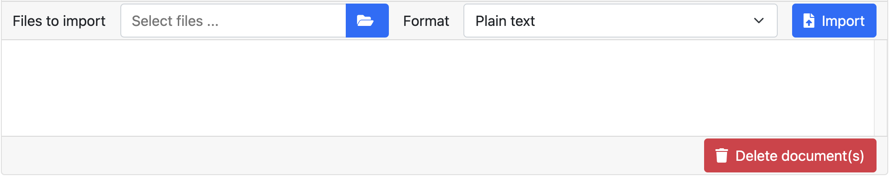

// Licensed to the Technische Universität Darmstadt under one
// or more contributor license agreements.  See the NOTICE file
// distributed with this work for additional information
// regarding copyright ownership.  The Technische Universität Darmstadt 
// licenses this file to you under the Apache License, Version 2.0 (the
// "License"); you may not use this file except in compliance
// with the License.
//  
// http://www.apache.org/licenses/LICENSE-2.0
// 
// Unless required by applicable law or agreed to in writing, software
// distributed under the License is distributed on an "AS IS" BASIS,
// WITHOUT WARRANTIES OR CONDITIONS OF ANY KIND, either express or implied.
// See the License for the specific language governing permissions and
// limitations under the License.
= Documents

The documents in a project can be managed on the documents panel. 

To upload one or more documents, use the folder icon in the *Files to import* field.
A browser dialog will open which allows you to navigate to some folder on your computer, select files, and then upload them.
Typically, you can select multiple files in this dialog either by holding the *control* key on your keyboard then then selecting them one-by-one with the mouse - or by clicking on the first file, then holding *shift* on the keyboard and then clicking on the last file - thereby selecting all files in between the two.
Note that if you upload multiple files, they must all have the same format.

After selecting the files, use the *Format* dropdown to choose which format your files are in.
A project can contain files in different formats.

Finally, use the *Import* button to upload the files and add them to the project. 

To delete a document from the project, you have to click on it and then click on *Delete* in the right lower corner.
Again, you can select multiple files for deletion using with the aid of the *control* or *shift* keys on the keyboard.

.Uploading large numbers of documents
While it is possible to upload multiple documents at once, there are limits to how many documents can be uploaded in a single upload operation.
For a start, it can take quite some time to upload thousands of documents.
Also, the server configuration limits the individual file size and total batch size (the default limit is 100MB for both).
Finally, browsers differ in their capability of dealing with large numbers of documents in an upload.
In a test with 5000 documents of each ca. 2.5kb size including Chrome, Safari and Firebird, only Chrome (80.0.3987.122) completed the operation successfully.
Safari (13.0.5) was only able to do upload about 3400 documents.
Firebird (73.0.1) froze during the upload and was unable to deliver anything to the server.
With a lower number of documents (e.g. 500), none of the browsers had any problems.
