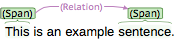
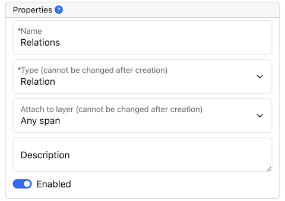
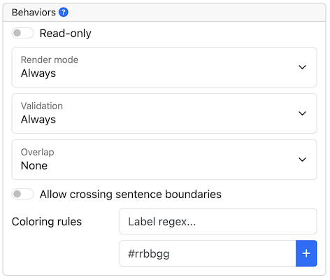

// Licensed to the Technische Universität Darmstadt under one
// or more contributor license agreements.  See the NOTICE file
// distributed with this work for additional information
// regarding copyright ownership.  The Technische Universität Darmstadt 
// licenses this file to you under the Apache License, Version 2.0 (the
// "License"); you may not use this file except in compliance
// with the License.
//  
// http://www.apache.org/licenses/LICENSE-2.0
// 
// Unless required by applicable law or agreed to in writing, software
// distributed under the License is distributed on an "AS IS" BASIS,
// WITHOUT WARRANTIES OR CONDITIONS OF ANY KIND, either express or implied.
// See the License for the specific language governing permissions and
// limitations under the License.

[[sect_projects_layers]]
= Layers 

[.i7n-assistant]
--
**Annotation layers** define the structure of the annotations in a project.
Each layer belongs to structural **type** that defines whether it is a span, a relation, a chain, or a document metadata layer.
**Span layers** are used to annotate continuous segments of text.
**Relation layers** are used to annotate relations between spans.
**Chain layers** are used to annotate directed sequences of connected spans.
**Document metadata layers** are used to annotate document-level information.
Each layer can have **features** that carry additional information about the annotations.
Typically, a layer will have at least one feature that carries the annotation label.
--

== Adding a pre-defined layer

[.i7n-assistant]
--
{product-name} comes with a set of pre-defined layers that allow you to start annotating immediately.
To add a pre-defined layer to your project, use the **Add** button at the top of the **Layers** tab in your project settings.
Once a layer has been added, you can configure its features and behaviors.
--

== Creating a custom layer

[.i7n-assistant]
--
To create a cuastom layer, use the **Create** button at the top of the **Layers** tab in your project settings.
Set at least a **name** and a **type** for the layer in order to save and thereby create the layer.
Once a layer has been created, you can configure its features and behaviors.
--

In the following example, we will create a custom layer called *Sentiment* with a feature called *Polarity* that can be *negative*, *neutral*, or *positive*.

. Create the layer _Sentiment_
  * Go to the *Layers* tab in your project's settings and press the *Create layer* button
  * Enter the name of the layer in *Layer name*: _Sentiment_
  * Choose the *type* of the layer: _Span_
  * Enable *Allow multiple tokens* because we want to mark sentiments on spans longer than a single token.
  * Click the *Save layer* button
. Create the feature _Polarity_
  * Click the *New feature* button
  * Choose the *type* of the feature: _Primitive: String_
  * Enter the *name* of the feature: _Polarity_
  * Click *Save feature*
. Create the tagset _Polarity values_
  * Go to the *Tagsets* tab and press *Create tagset*
  * Enter the *name* of the tagset: _Polarity values_
  * Click *Save tagset*
  * Click *Create tag*, enter the *name* of the tag: _negative_, press *Save tag*
  * Repeat for _neutral_ and _positive_
. Assign the tagset _Polarity values_ to the feature _Polarity_
  * Back in the *Layers* tab, select the layer: _Sentiment_ and select the feature: _Polarity_
  * Set the *tagset* to _Polarity values_
  * Click *Save feature*

Now you have created your first custom layer.

== Built-in layers

{product-name} comes with a set of built-in layers that allow you to start annotating immediately. Also, many import/export formats only work with these layers as their semantics are known.
For this reason, the ability to customize the behaviors of built-in layers is limited and it is not possible to extend them with custom features.

NOTE: The built-in layers are a subset of the pre-defined layers.

.Built-in layers
[cols="1,2,2v", options="header"]
|====
| Layer | Type | Enforced behaviors

| Chunk
| Span
| Lock to multiple tokens,
no overlap,
no sentence boundary crossing

| Coreference
| Chain
| _(no enforced behaviors)_

| Dependency
| Relation over POS,
| Any overlap,
no sentence boundary crossing

| Lemma
| Span
| Locked to token offsets,
no overlap,
no sentence boundary crossing

| Named Entity
| Span
| _(no enforced behaviors)_

| Part of Speech (POS)
| Span
| Locked to token offsets,
no overlap,
no sentence boundary crossing
|====

The coloring of the layers signal the following: 

.Color legend
[cols="1,2", options="header"]
|===
| Color
| Description

| green
| built-in annotation layer, enabled

| blue
| custom annotation layer, enabled

| red
| disabled annotation layer
|===

To create a custom layer, select *Create Layer* in the *Layers* frame.
Then, the following frame will be displayed. 

.Exporting layers
At times, it is useful to export the configuration of a layer or of all layers, e.g. to copy them
to another project.
There are two options:

* **JSON (selected layer)**: exports the currently selected layer as JSON.
  If the layer depends on other layers, these are included as well in the JSON export.
* **UIMA (all layers)**: exports a UIMA type system description containing all layers of the project.
  This includes built-in types (i.e. DKPro Core types) and it may include additional types required
  to allow loading the type system description file again.
  However, this type system description is usually not sufficient to interpret XMI files produced by {product-name}.
  Be sure to load XMI files together with the type system description file which was included in the XMI export.
  
Both types of files can be imported back into {product-name}.
Note that any built-in types that have have been included in the files are ignored on import.

[[sect_projects_layers_properties]]
== Properties 

.Properites
[cols="1,2", options="header"]
|====
| Property | Description

| Name
| The name of the layer (obligatory).

| Type
| The type of the layer (see below).

| Description
| A description of the layer. 
This information will be shown in a tooltip when the mouse hovers over the layer name in the annotation detail editor panel.

| Enabled
| Whether the layer is enabled or not. 
Layers can currently not be deleted, but they can be disabled.
|====

NOTE: When a layer is first created, only ASCII characters are allowed for the layer name because the internal UIMA type name is derived from the initial layer name.
After the layer has been created, the name can be changed arbitrarily.
The internal UIMA type name will not be updated.
The internal UIMA name is e.g. used when exporting data or in constraint rules.

The layer type defines the structure of the layer.
Three different types are supported: spans, relations, and chains.

.Layer types
[cols="1,2,3", options="header"]
|====
| Type 
| Description 
| Example

| Span
| Continuous segment of text delimited by a start and end character offset.
The example shows two spans.
| image:images/project_layer_type_span.png[]

| Relation
| Binary relation between two spans visualized as an arc between spans.
The example shows a relation between two spans.
For relation annotations the type of the spans which are to be connected can be chosen in the field *Attach to layer*.
Here, only non-default layers are displayed.
To create a relation, first the span annotation needs to be created.

| 

| Chain
| Directed sequence of connected spans in which each span connects to the following one.
The example shows a single chain consisting of three connected spans.
| image:images/project_layer_type_chain.png[]
|====

[[sect_projects_layers_behaviours]]
== Behaviours

.Behaviors
[cols="1v,2", options="header"]
|====
| Behavior | Description

| Read-only
| Annotations on this layer may be viewed but not edited.

| Show text on hover
| Whether the text covered by the annotation is shown in the popup panel that appears when hovering with the mouse over an annotation label. 
Note that this popup may not be supported by all annotation editors.

| Render mode
_(relation / chain)_
| Determines when to render relation or chain arcs. 
Possible settings are **Always** (always render arcs), **Never** (never render arcs), and **When selected** (render arcs only when one of the relation endpoints or the relation itself is selected - or in case of chains, when some element of the chain is selected). 
Note that this setting is only available for relation and chain layers.

| Validation
| When pre-annotated data is imported or when the  behaviors settings are changed, it is possible that annotations exist which are not conforming to the current behavior settings. This setting controls when a validation of annotations is performed. Possible settings are **Never** (no validation when a user marks a document as finished) and **Always** (validation is performed when a user marks a document as finished). Mind that changing the document state via the Monitoring page does not trigger a validation. Also, problematic annotations are highlighted using an error marker in the annotation interface. **NOTE:** the default setting for new projects/layers is **Always**, but for any existing projects or for projects imported from versions of {product-name} where this setting did not exist yet, the setting is initialized with **Never**.

| Granularity
_(span, chain)_
| The granularity controls at which level annotations can be created. When set to **Character-level**, annotations can be created anywhere. Zero-width annotations are permitted.
When set to **Token-level** or **Sentence-level** annotation boundaries are forced to coincide with token/sentence boundaries.
If the selection is smaller, the annotation is expanded to the next larger token/sentence covering the selection.
Again, zero-width annotations are permitted. When set to **Single tokens only** may be applied only to a single token.
If the selection covers multiple tokens, the annotation is reduced to the first covered token at a time. 
Zero-width annotations are not permitted in this mode.
Note that in order for the **Sentence-level** mode to allow annotating multiple sentences, the **Allow crossing sentence boundary** setting must be enabled, otherwise only individual sentences can be annotated.

| Overlap
| This setting controls if and how annotations may overlap.
For **span layers**, overlap is defined in terms of the span offsets. 
If any character offset that is part of span *A* is also part of span *B*, then they are considered to be **overlapping**.
If two spans have exactly the same offsets, then they are considered to be **stacking**.
For **relation layers**, overlap is defined in terms of the end points of the relation.
If two relations share any end point (source or target), they are considered to be **overlapping**.
If two relations have exactly the same end points, they are considered to be **stacking**.
Note that some export formats are unable to deal with stacked or overlapping annotations.
E.g. the CoNLL formats cannot deal with overlapping or stacked named entities.

| Allow crossing sentence boundary
| Allow annotations to cross sentence boundaries.

| Behave like a linked list
_(chain)_
| Controls what happens when two chains are connected with each other.
If this option is *disabled*, then the two entire chains will be merged into one large chain.
Links between spans will be changed so that each span connects to the closest following span -  no arc labels are displayed.
If this option is *enabled*, then the chains will be split if necessary at the source and target points, reconnecting the spans such that exactly the newly created connection is made - arc labels are available.
|====

=== Key bindings

Key bindings can be used to quickly set feature values on the currently selected annotation.
They are supported for certain feature types such as string and concept features.
E.g. you could assign the shortcut `CTRL P` to the value `PER` for the *value* feature of the *Named Entity* layer.
So when you create a *Named Entity* annotation and then press the kbd:[CTRL + P], the value would be set to `PER`.

NOTE: If the input focus is on an input field, the key bindings are suppressed.
      That means, you could even assign single key shortcuts like kbd:[p] for `PER` while still be able to use kbd:[p] when entering text manually into an input field.
      Normally, the focus would jump directly to the first feature editor after selecting an annotation. 
      But this is not the case if any features have key bindings, because it would render the key bindings useless (i.e. you would have to click outside of the feature editor input field so it looses the focus, thus activating the key bindings).

When defining a key binding, you have to enter a key combo consisting of one or more of the 
following key names:

* Modifier keys: kbd:[Ctrl], kbd:[Shift], kbd:[Alt], kbd:[Meta]
* Letter keys: kbd:[a], kbd:[b], kbd:[c], kbd:[d], kbd:[e], kbd:[f], kbd:[g], kbd:[h], kbd:[i], kbd:[j], kbd:[k], kbd:[l], kbd:[m], kbd:[n], kbd:[o], kbd:[p], kbd:[q], kbd:[r], kbd:[s], kbd:[t], kbd:[u], kbd:[v], kbd:[w], kbd:[x], kbd:[y], kbd:[z]
* Number keys: kbd:[0], kbd:[1], kbd:[2], kbd:[3], kbd:[4], kbd:[5], kbd:[6], kbd:[7], kbd:[8], kbd:[9]
* Function keys: kbd:[F1], kbd:[F2], kbd:[F3], kbd:[F4], kbd:[F5], kbd:[F6], kbd:[F7], kbd:[F8], kbd:[F9], kbd:[F10], kbd:[F11], kbd:[F12]
* Navigation keys: kbd:[Home], kbd:[End], kbd:[Page_up], kbd:[Page_down], kbd:[Left], kbd:[Up], kbd:[Right], kbd:[Down]
* Other keys: kbd:[Escape], kbd:[Tab], kbd:[Space], kbd:[Return], kbd:[Enter], kbd:[Backspace], kbd:[Scroll_lock], kbd:[Caps_lock], kbd:[Num_lock], kbd:[Pause], kbd:[Insert], kbd:[Delete]

Typically you would combine zero or more modifier keys with a *regular* key (letter, number, 
function key, etc). A combination of multiple number or letter keys does not work.

NOTE: Mind that you need to take care not to define the same key binding multiple times.
Duplicate definitions are only sensible if you can ensure that the features on which they are defined will never be visible on screen simultaneously. 
      
=== Coloring rules

[.i7n-assistant]
--
Coloring rules can be used to control the coloring of annotations.
The coloring rules are defined at the level of the annotation layer.
Select an annotation layer from the list of layers in the project settings, then look for the *Coloring rules* section in the layer settings.

A rule consists of two parts:
1) a regular expression pattern that matches the annotation label,
2) a hexadecimal color code.

A simple rule could be use the pattern `PER` and the color code `#0000ff` (blue).
This would display all annotations with the label `PER` belonging to the layer in blue.

In order to assign the same color to all annotations belonging to the layer, use the pattern `.*`.
--

It is also possible to assign a color to multiple label at once by exploiting the fact that the pattern is a regular expression.
E.g. `PER|OTH` would match annotations with the label `PER` as well as with the label `OTH`.
Mind not to add extra space such as `PER | OTH` - this would not work!

Be careful when creating coloring rules on layers with multiple features.
If there are two features with the values `a` and `b`, the label will be `a | b`.
In order to match this label in a coloring rule, the pipe symbol (`|`) must be escaped - otherwise it is interpreted as a regular expression `OR` operator: `a \| b`. 
