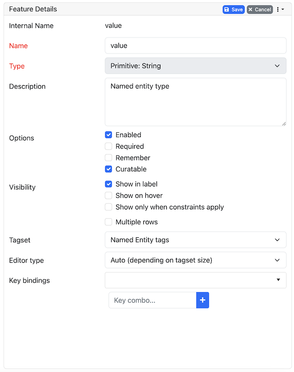

// Licensed to the Technische Universität Darmstadt under one
// or more contributor license agreements.  See the NOTICE file
// distributed with this work for additional information
// regarding copyright ownership.  The Technische Universität Darmstadt 
// licenses this file to you under the Apache License, Version 2.0 (the
// "License"); you may not use this file except in compliance
// with the License.
//  
// http://www.apache.org/licenses/LICENSE-2.0
// 
// Unless required by applicable law or agreed to in writing, software
// distributed under the License is distributed on an "AS IS" BASIS,
// WITHOUT WARRANTIES OR CONDITIONS OF ANY KIND, either express or implied.
// See the License for the specific language governing permissions and
// limitations under the License.
[[sect_projects_layers_features]]
= Features

In this section, features and their properties can be configured. 

NOTE: When a feature is first created, only ASCII characters are allowed for the feature name because the internal UIMA name is derived from the initial layer name.
After the feature has been created, the name can be changed arbitrarily.
The internal UIMA feature name will not be updated.
The internal UIMA name is e.g. used when exporting data or in constraint rules.

NOTE: Features cannot be added to or deleted from built-in layers.

.General feature properties
[cols="1v,2", options="header"]
|====
| Property | Description

| Internal name
| Internal UIMA feature name

| Type
| The type of the feature (obligatory).

| Name
| The name of the feature (obligatory).

| Description
| A description that is shown when the mouse hovers over the feature name in the annotation detail editor panel.

| Enabled
| Features cannot be deleted, but they can be disabled

| Show in label
| Whether the feature value is shown in the annotation label. If this is disabled, the feature is only visible in the annotation detail editor panel.

| Show on hover
| Whether the feature value is shown in the popup panel that appears when hovering with the mouse over an annotation label. Note that this popup may not be supported by all annotation editors.

| Remember
| Whether the annotation detail editor should carry values of this feature
over when creating a new annotation of the same type. This can be useful when creating many annotations
of the same type in a row.

| Curatable
| Whether the feature is considered when comparing whether annotations are equal and can be
pre-merged during curation. This flag is enabled by default. When it is disabled, two annotations
will be treated as the same for the purpose of curation, even if the feature value is different.
The feature value will also not be copied to a pre-merged or manually merged annotation. Disabling
this flag on all features of a layer will cause annotations to be only compared by their positions.
|====