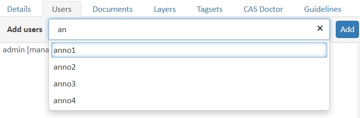
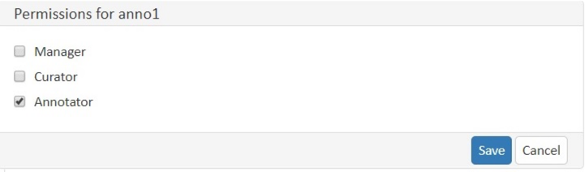

// Licensed to the Technische Universität Darmstadt under one
// or more contributor license agreements.  See the NOTICE file
// distributed with this work for additional information
// regarding copyright ownership.  The Technische Universität Darmstadt 
// licenses this file to you under the Apache License, Version 2.0 (the
// "License"); you may not use this file except in compliance
// with the License.
//  
// http://www.apache.org/licenses/LICENSE-2.0
// 
// Unless required by applicable law or agreed to in writing, software
// distributed under the License is distributed on an "AS IS" BASIS,
// WITHOUT WARRANTIES OR CONDITIONS OF ANY KIND, either express or implied.
// See the License for the specific language governing permissions and
// limitations under the License.

= Users

This pane allows managing the users that have access to the project and their permissions.

To add users:

1. Click on the *Add users* text field.
2. A dropdown list of enabled users in the system appears.
   Users already in the project are not shown.
3. Start typing to filter the list. Select a user by clicking on their name or pressing kbd:[Enter].
4. Repeat to add more users.
5. When finished, click the *Add* button to add the selected users to your project.

NOTE: For privacy reasons, the administrator may restrict the users shown in the dropdown.
      In this case, you must enter the full name of a user before they appear in the dropdown and can be added.

By default, users are added to the project as annotators.

To assign additional roles or permissions:

1. Click on the user in the list.
2. In the *Permissions* pane, select the appropriate permissions.
3. Click *Save* to apply the changes.

To remove a user from the project:

1. Remove all permissions for the user in the *Permissions* pane.
2. Click *Save*.

This will remove the user from the project.
