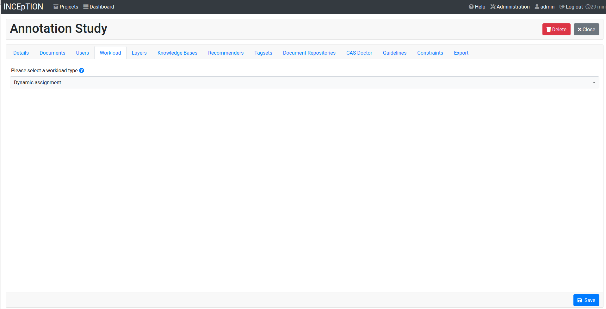

// Licensed to the Technische Universität Darmstadt under one
// or more contributor license agreements.  See the NOTICE file
// distributed with this work for additional information
// regarding copyright ownership.  The Technische Universität Darmstadt 
// licenses this file to you under the Apache License, Version 2.0 (the
// "License"); you may not use this file except in compliance
// with the License.
//  
// http://www.apache.org/licenses/LICENSE-2.0
// 
// Unless required by applicable law or agreed to in writing, software
// distributed under the License is distributed on an "AS IS" BASIS,
// WITHOUT WARRANTIES OR CONDITIONS OF ANY KIND, either express or implied.
// See the License for the specific language governing permissions and
// limitations under the License.

[[sect_dynamic_workload]]
= Dynamic assgiment

Use *dynamic assignment* if you want to get your documents each annotated by a certain number of annotators and do not care about which annotator annotates which documents.

To enable the *dynamic assignment* workload manager, go to the *Workload* tab in the project settings.

When dynamic assignment is enabled, annotators can no longer actively choose which documents they want to annotate. Any functionality for opening a particular document or switching between documents on the annotation page are disabled. When the annotator opens the annotation page, a document is automatically selected for annotation. The only way to progress to the next document is by marking the current document as *finished*.

The dynamic workload management page gives the project manager a fast overview of all documents and users within the current project. Additionally, the automatic distribution of documents to annotators can be modified.

image::images/workload.png[align="center"]

Therefore, it mainly consists of a substantial, but easy to understand table containing the data a project manager
needs from their documents. This data is represented by a unique row for each individual document in the project. The following
columns with the respective data are displayed:

1. *State:* state of the document within the project.
2. *Document:* document name.
3. *Assigned:* number of annotators, who are working currently on the document.
4. *Finished:* number of annotators, who have already finished their work on the document.
5. *Annotators:* names of all annotators, who are either working on the document or have already finished it.
6. *Updated:* time of the last change that has been made to the document. It either shows "today", "yesterday", "2 days ago" ... , or when the last change is longer than 6 days ago,
the exact date is shown.

You can also configure display and workload settings using the three buttons on the top left corner of the table: Filter, Annotators and Settings.

. *Filters:* You can apply different filters to the document list e.g. show only documents that are annotated by one user or were working on in a specific time period.
The filters are accumulative, which means that you can filter based on several criteria simultaneously.
. *Annotators:* Allows to directly assign annotators to specific documents.
. *Settings:* See below.

Finally, also a small *quick filter* is integrated to the workload page on the top right corner. Upon selecting different states, the table will be filtered towards these in real time. These states are the same as the ones represented in the first column *State*. As default, all states will be shown in the table.

Overall, the workload feature shall support annotation projects in their organization. Thanks to the table, the filtering and the options for the annotation workflow and the annotators, the project manager now has more flexibility and insight in his projects' progress. Also,the redesigned annotation flow ensures better results from the annotations, as the data will be better distributed throughout the project.

Click on an annotator badge in the *annotators* column to cycle through the annotation states. Right-click on the badge for additional actions such as the option to *reset* the annotations.

== Dynamic workload settings

Annotators per document:: Controls how many annotators need to have marked a document as *finished* for the document to be considered as completely annotated. As soon as an annotator opens a document, the document becomes assigned to that user. A document will not automatically be *assigned* to more than the number of annotators configured here.

Workflow policy:: Controls the order in which documents are presented to annotators. Default workflow means, that the documents are simply passed to the annotators in alphabetical order. Randomized workflow, as the name already explains, selects randomly from all documents each time a new document is requested by an annotator.

Handle abandoned documents:: Whether to *unassign* a document from an annotator if the annotator has not marked the document as *finished* after a certain amount of time. If this option is not enabled, a manager or curator should regularly check the project status to ensure that no documents are stuck in an unfinished state because the assigned annotators do not work on them.

Abandonation timeout:: The number of minutes after the last update performed by an annotator before a document is considered to have been abandoned. Documents are never considered abandoned as long as the annotator is still logged into system. Typical settings are to consider a document as abandoned after 24 hours or 7 days. 

Abandonation state:: The state into which to transition the document once it has been found to be abandoned. It is recommended to transition abandoned documents to the *locked* state. In this state, the document becomes available to other annotators, the annotations are not used e.g. in agreement calculations yet any annotations potentially already made by the annotator are kept. It is also possible to transition documents to the *finished* state. However, other annotators will then not get the option to complete the document and the (unfinished) annotations end up becoming available to e.g. the agreement calculations. Finally, it is possible to reset the document to the *new* state and to irrevocably *discard* any annotations the annotator may already have made. When an annotation has been found to be abandoned, it is marked with a yellow background and a *person/clock* symbol in the table. To take the annotations out of the abandoned state, you can right-click on the state badge to get a menu with possible actions. Select *touch* to update the annotation's timestamp to the current time, taking the annotations out of the abandoned state with all annotations intact - this will give the annotator the opportunity to complete the annotations. After the abandoned state has been removed, you can also again click on the badge to change its state. You can also select *reset* to discard the annotations.
