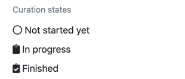
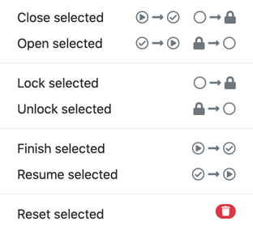

// Licensed to the Technische Universität Darmstadt under one
// or more contributor license agreements.  See the NOTICE file
// distributed with this work for additional information
// regarding copyright ownership.  The Technische Universität Darmstadt 
// licenses this file to you under the Apache License, Version 2.0 (the
// "License"); you may not use this file except in compliance
// with the License.
//  
// http://www.apache.org/licenses/LICENSE-2.0
// 
// Unless required by applicable law or agreed to in writing, software
// distributed under the License is distributed on an "AS IS" BASIS,
// WITHOUT WARRANTIES OR CONDITIONS OF ANY KIND, either express or implied.
// See the License for the specific language governing permissions and
// limitations under the License.

[[sect_matrix_workload]]
= Static assignment

Use *static assignment* if annotators should be able to freely choose which documents they want to annotate in which order and/or if you want to precisely control which annotator should be able to access which document.

To enable the *static assignment* workload manager, go to the *Workload* tab in the project settings.

In this mode, the workload management page allows you to monitor the progress of your annotation project. It also allows you to change the status of the annotation and curation documents. This allows you:

* to control which users should annotator which documents,
* to re-open document marked as finished so annotators can correct mistakes
* to close documents to prevent annotators from further working on them
* to reset documents so annotators can start over from scratch

== Annotation state management

.Annotation states
image::images/monitoring-annotation-states.png[role=right]

To change the annotation state of a document, click on the table cell in the row for the respective document and in the column for the respective user.

It is possible to discard all annotations by a user for a particular document by right-clicking on the table cell and choosing **Reset**. This is a permanent action that cannot be undone. The state is then set back to **new** and the user has to start over.

In order to lock a document for a user who has already started annotating, the document first needs to be reset and then it can be locked.

.Annotation state transitions
|===
| Current state | New state

| Not started yet (new)
| Locked

| Locked
| Not started yet (new)

| In progress
| Finished

| Finished
| In progress
|===

== Curation state management

.Curation states

To change the curation state of a document, click on the table cell in the row for the respective document and in the column *Curation*.

It is possible to discard all the curation for particular document by right-clicking on the table cell and choosing **Reset**. This is a permanent action that cannot be undone. The state is then set back to **new** and the curation process has to start over.

.Curation state transitions
|===
| Current state | New state

| Not started yet (new)           
| _(no change possible until curation starts)_

| In progress        
| Finished

| Finished      
| In progress
|===

== Bulk changes

.Bulk actions

To facilitate management in projects with many users and documents, it is possible to enable the *Bulk change* mode by clicking the respective button in the table title.

In bulk-change mode, checkboxes appear for every row and every annotator column. These can be used to select the entire row and/or column. It is possible to select multiple rows/columns. The selected cells are highlighted in the table. Note that selecting a column means that **all** the rows for that column are selected, even though due to paging only a subset of them may visible at any time in the table. Also, if you select a row, that row remains selected even if you switch to another table page.

Once you have selected the document rows / annotator columns you want to change, use the dropdown menu next to the **Bulk change** button to select a bulk action.

When applying a bulk action, only those cells which permit the requested transition are affected. For example, image you select an annotator column containing documents that are new, in progress and some that are locked. Applying the **Finish selected** bulk action now will affect only the documents that are already in progress but not any of the new or locked documents.

To facilitate wrapping up annotations for a user or document, there is the combo action **Close all** which will lock any documents on which work has not started yet and mark and ongoing annotations as finished. 

== Filtering

It is possible to filter the table by document name and/or user name. If a filter has been set, then
bulk actions are applied only to those rows and column which match the filter and which are selected
for the bulk operation.

The document name and user name filters can be set in two ways: 
* "contains" match or
* regular expression

The regular expression mode can be enabled by activating the checkbox `(.*)` next to the
filter text field. For example, with the checkbox enabled, you could search for `^chapter01.*` to match
all documents whose name starts with `chapter01` or for `train|test` to match all documents containing
`train` or `test` in their name.

== Navigation between documents

By default, annotators and curators can navigate freely between accessible documents in the matrix
workload mode. However, there can be cases where users should be directed from an external system 
only to specific documents and they should not be offered the ability to simply navigate to another
document. In this case, the option **Allow annotators to freely navigate between documents** can be
turned off in the matrix workload settings panel in the project settings. 

NOTE: This only disables the navigation elements. Direct access to accessible documents through the
      URL is still possible. An external workload management system would need to explicitly lock documents
      to prevent users from accessing them.

== Ability to re-open documents

When an annotator marks a document as **Finished**, the document becomes uneditable for them. 
By default, the only way to re-open a document for further annotation is that a curator or project manager opens the workload management page and changes the state of the document there.

However, in some cases, it is more convenient if annotators themselves can re-open a document and continue editing it. 
The option **Reopenable by annotators** in the **Settings** dialog on the workload management can be enabled to allow annotators put finished documents back into the **in progress** state directly from the annotation page by clicking on the **Finish/lock** button in the action bar. 
If this option is enabled, the dialog that asks users to confirm that they wish to mark a document is finished is not shown.

NOTE: This option only allows annotators to re-open documents that they have closed themselves. 
    If a document has been marked as finished by a project manager or curator, the annotators can not re-open it. 
    On the workload management page, documents that have been explicitly closed by a curator/manager bear a double icon in their state column (e.g. **finished (in progress)**).
    
